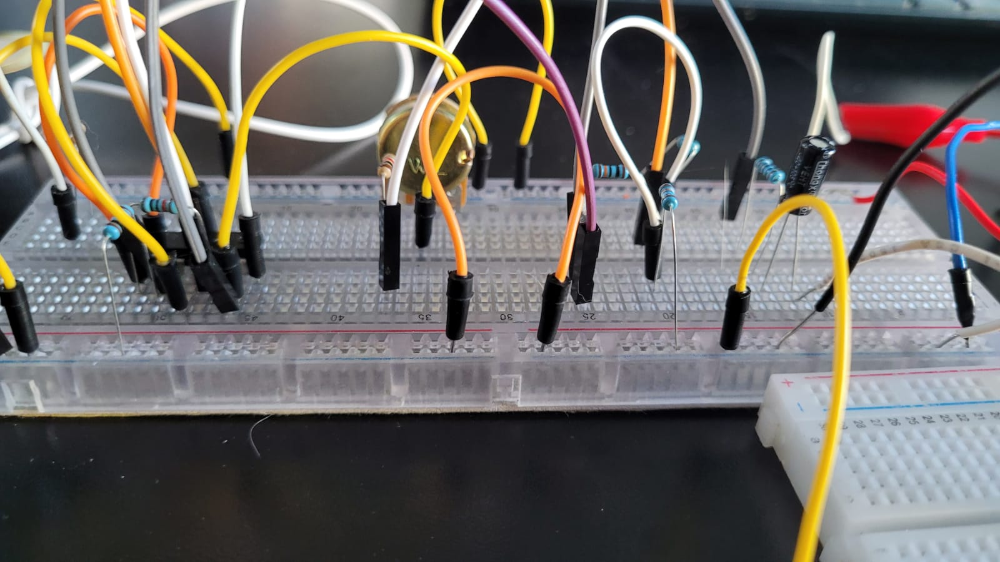
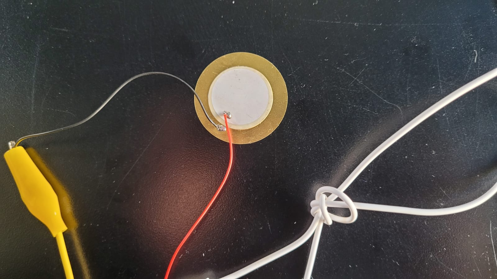
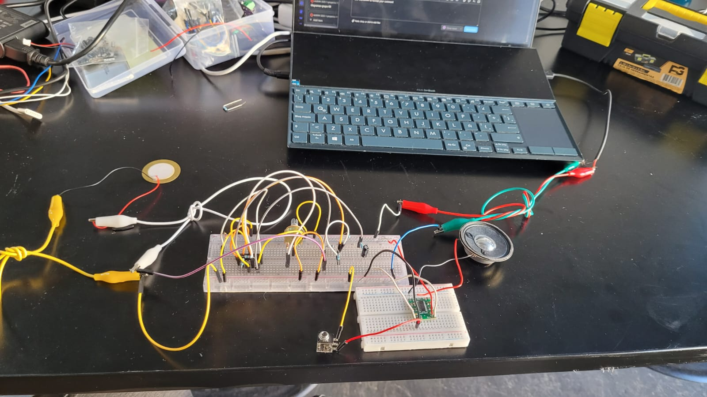
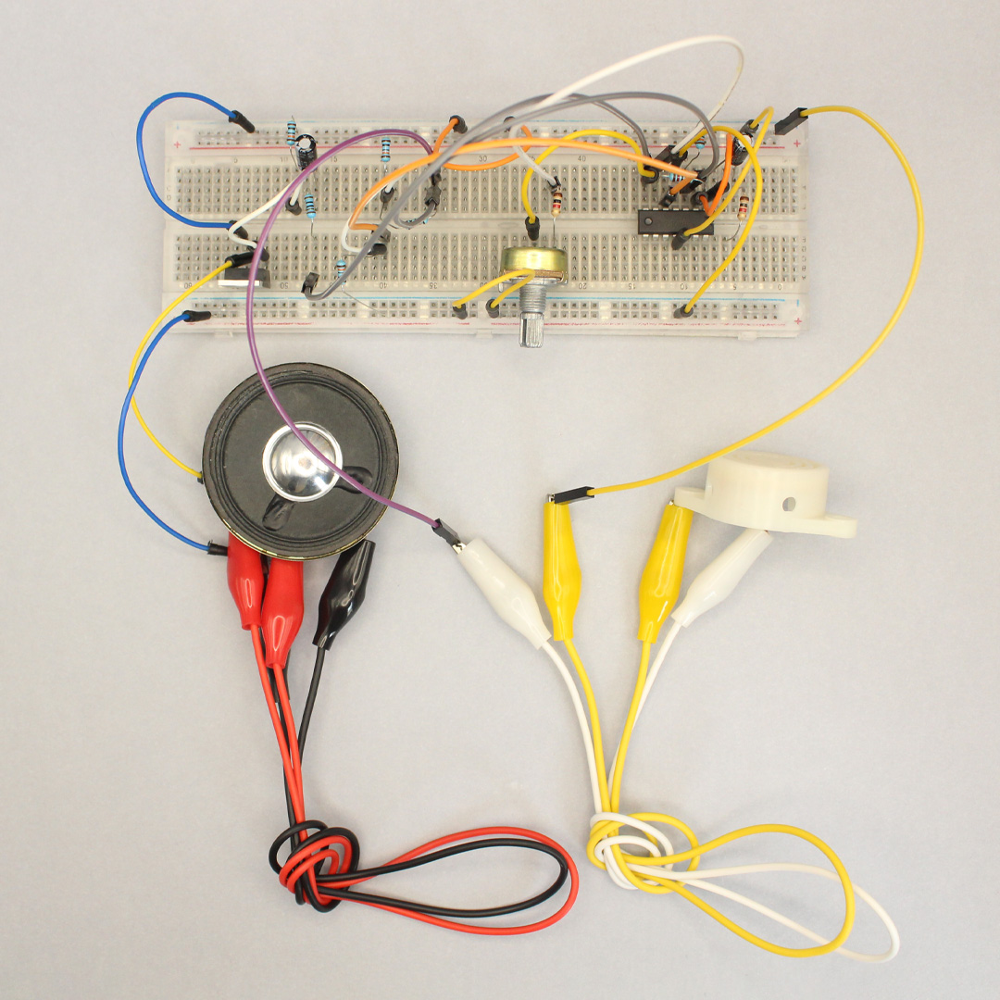
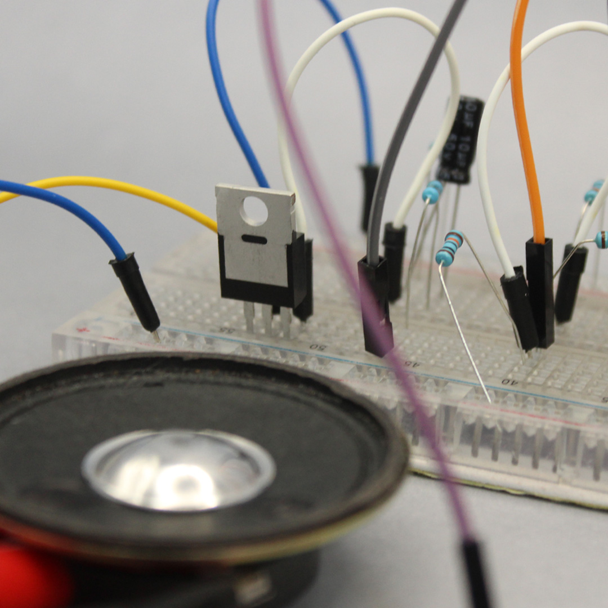
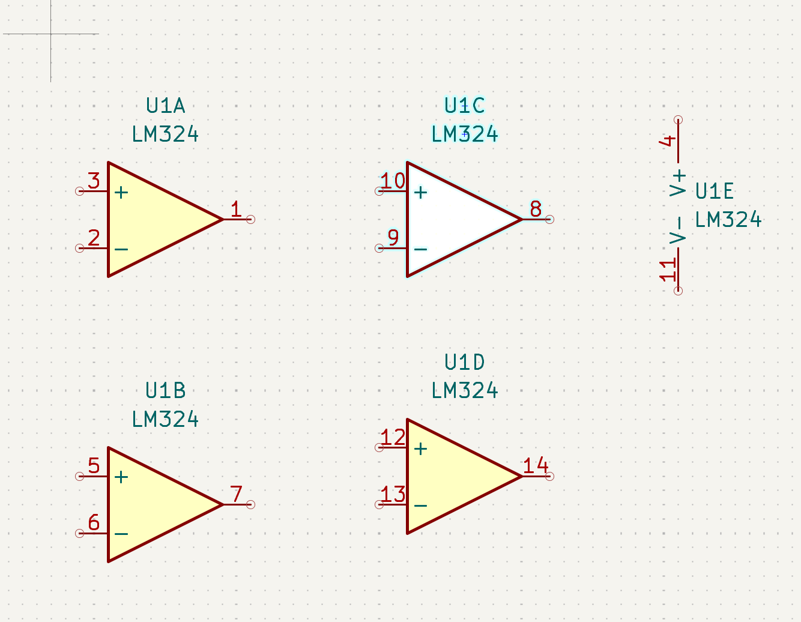
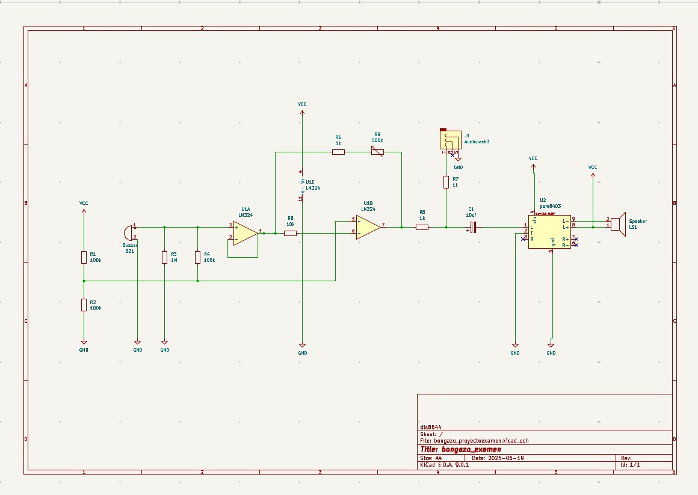
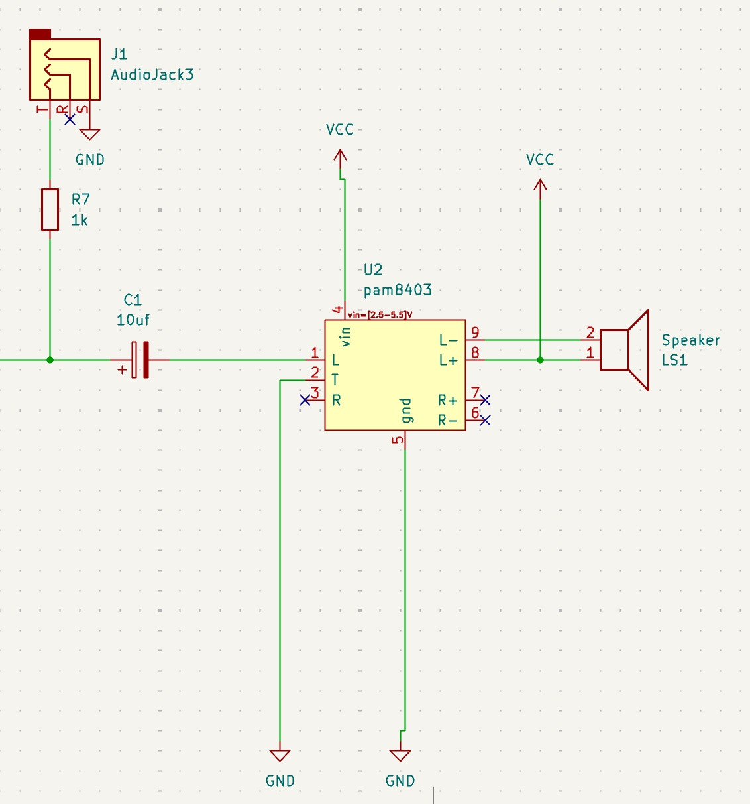

# proyecto-02

## Acerca del proyecto

- Grupo: 02
- Integrantes:
  - Sofía Etchepare
  - Antonia Fuentealba
  - Sofía Pérez
- Chips usados:
  - Chip lm324

## Presentación textual

El proyecto consiste en una máquina con tapa percutible que activa un sonido al golpearla, con parlante incorporado que se silencia al conectar la salida jack

## Dibujos de diagramas del circuito (1 punto)

Este es el diagrama a mano.

En este dibujo mostramos el funcionamiento lógico del sistema de percusión electrónica.  
El proceso inicia cuando la batería es conectada a la PCB. Si la batería tiene carga, el sistema se activa; de lo contrario, permanece inactivo.

Una vez activo, si se golpea la tapa (bongo), se genera una señal de audio.  
Esa señal se dirige dependiendo del estado del jack de salida:  

- Si **está conectado**, la señal se envía al **jack de salida**.  
- Si **no está conectado**, la señal se envía al **parlante incorporado**.

Este flujo asegura que el sistema responda correctamente al estímulo físico, priorizando la salida externa cuando esté disponible.

## Prototipado de circuitos en protoboard (1 punto)

A continuación se muestra la protoboard final, con componentes nuevos y nuevas conexiones.

### Circuito de Entrada

El circuito de entrada usa un sensor piezoeléctrico para detectar impactos o vibraciones. Este componente convierte la energía mecánica (como un golpe o presión) en una señal eléctrica.

La señal generada pasa por una red de resistencias y un divisor de voltaje, que acondiciona la señal para su correcto procesamiento. También se incluye un potenciómetro, que permite ajustar la sensibilidad del sistema frente a los estímulos físicos.

### Circuito de Salida

El circuito de salida utiliza un amplificador de audio para aumentar la señal y alimentar un parlante pequeño. De esta manera, se genera un sonido cuando se detecta un golpe sobre el sensor.

El amplificador recibe la señal desde el circuito de control, el cual se encarga de generar una señal de salida cuando el sensor detecta un evento.

## Bill of Materials (1 punto)

| Componente                   | Cantidad | Comentarios         |
|-----------------------------|----------|----------------------|
| Chip                        | 1        | LM324               |
| Piezoeléctrico              | 1        |                      |
| Resistencia                 | 1        | 1M                   |
| Resistencia                 | 3        | 100k                 |
| Resistencia                 | 4        | 1k                   |
| Resistencia                 | 2        | 10k                  |
| Resistencia                 | 1        | 22k                  |
| Condensador polarizado     | 2        | 10uF                 |
| Potenciómetro              | 1        | 500k                 |
| Socket jack                | 1        | 3.5mm                |
| Parlante (Speaker)         | 1        | 8Ω                   |
| Jumpers (caimanes)         | 2        |                      |
| Fuente de alimentación     | 1        | 5V máx.              |
| Socket                     | 1        | Para LM324           |
| Conectores                 | -        |                      |
| Amplificador               | 1        | PAM8403              |

Fue necesario adquirir un sensor piezoeléctrico. Este componente fue clave para permitir la detección de percusiones o vibraciones en el dispositivo.

## Ayudas y comunicación con colegas (1 punto)

Con la ayuda y orientación de @disenoUDP/docentes pudimos salir del estancamiento al momento de prototipar el circuito de nuestro proyecto. Gracias a su acompañamiento, logramos que funcionara con fallos mínimos.

La primera vez que se armó la protoboard, el circuito no funcionaba correctamente, por lo que pedimos ayuda a @SebastianSaez1003. Su apoyo fue fundamental: nos ayudó a ordenar la protoboard y ofreció un feedback detallado sobre la conexión de los componentes. Al revisar paso a paso el esquemático y replicarlo en físico, pudimos entender mucho mejor el funcionamiento del circuito.

También @Bernardita-lobo y @jotamorales-romulus nos ayudaron a documentar visualmente nuestro proceso de prototipado: desde los errores iniciales hasta el resultado final.

Con la ayuda de nuestro compañero @felix-rg416, pudimos comenzar a proyectar el diseño de la carcasa de nuestra máquina, algo que hasta ahora no teníamos completamente definido.

## Esquematico en Kicad (1 punto)

Con la ayuda de @misaaaaaa y @FranUDP pudimos resolver ciertas dudas que teníamos con respecto al esquemático y encontrar la mejor salida a esas problemáticas, tales como agregar ciertos símbolos y fue de mucha ayuda que nos dieran los links donde poder encontrarlos.

Explicación general del circuito:
Este circuito pertenece a un bongo eléctrico que utiliza un sensor piezoeléctrico para detectar los golpes. La señal generada por el piezo es procesada por dos amplificadores operacionales del integrado LM324. El primero actúa como buffer para estabilizar la señal, y el segundo como comparador que genera una salida limpia cuando el golpe supera cierto nivel. Esta salida activa un parlante interno (buzzer), a menos que se conecte un plug en la salida jack, la cual desactiva automáticamente el parlante para redirigir la señal hacia un amplificador externo.

Descripción de chips y conexiones:
El circuito usa un chip llamado LM324, que tiene cuatro amplificadores operacionales (op-amps), aunque en este caso solo se usan dos: el U1A y el U1B. El primero (U1A) se conecta como seguidor de voltaje, lo que significa que copia la señal que le llega (desde el piezoeléctrico) sin modificar su forma, pero dándole más estabilidad. Su entrada positiva recibe la señal del golpe, y su salida está conectada de vuelta a su entrada negativa, que es como se arma un seguidor.
Luego, esa señal estable pasa por una resistencia al segundo op-amp (U1B), que actúa como un comparador: compara la señal del golpe con un voltaje de referencia que se ajusta con una resistencia variable. Si el golpe supera ese nivel, el comparador activa la salida. Esa salida enciende un parlante, a través de una resistencia que limita la corriente. Además, la señal también va a una salida jack, que desconecta el parlante cuando se enchufa un cable, para que el sonido salga solo por el jack.

## PCB en Kicad (1 punto)

## Recursos adicionales

Fotos de los primeros prototipos

Esquematico en PDF
[bongazo_proyectoexamen.pdf](https://github.com/user-attachments/files/20829861/bongazo_proyectoexamen.pdf)

PCB en PDF
[bongazo_proyectoexamen (1).pdf](https://github.com/user-attachments/files/20829910/bongazo_proyectoexamen.1.pdf)

## Bibliografía

<https://www.electrofaustus.com/ef105-drum-thing>
