# proyecto-02

## Acerca del proyecto

- Grupo: 02
- Integrantes:
  - Sofía Etchepare
  - Antonia Fuentealba
  - Sofía Pérez
- Chips usados:
  - Chip lm324
 

## Presentación textual

El proyecto consiste en una máquina con tapa percutible que activa un sonido al golpearla, con parlante incorporado que se silencia al conectar la salida jack

## Dibujos de diagramas del circuito (1 punto)

Este es el diagrama a mano.

En este dibujo mostramos el funcionamiento lógico del sistema de percusión electrónica. 

El proceso inicia cuando la batería es conectada a la PCB. Si la batería tiene carga, el sistema se activa; de lo contrario, permanece inactivo.

Una vez activo, si se golpea la tapa (bongo), se genera una señal de audio. 

Esa señal se dirige dependiendo del estado del jack de salida: 

- Si está conectado, la señal se envía al jack de salida.  
- Si no está conectado, la señal se envía al parlante incorporado.

Este flujo asegura que el sistema responda correctamente al estímulo físico, priorizando la salida externa cuando esté disponible.

## Prototipado de circuitos en protoboard (1 punto)

A continuación se muestra la protoboard final, con componentes nuevos y nuevas conexiones.

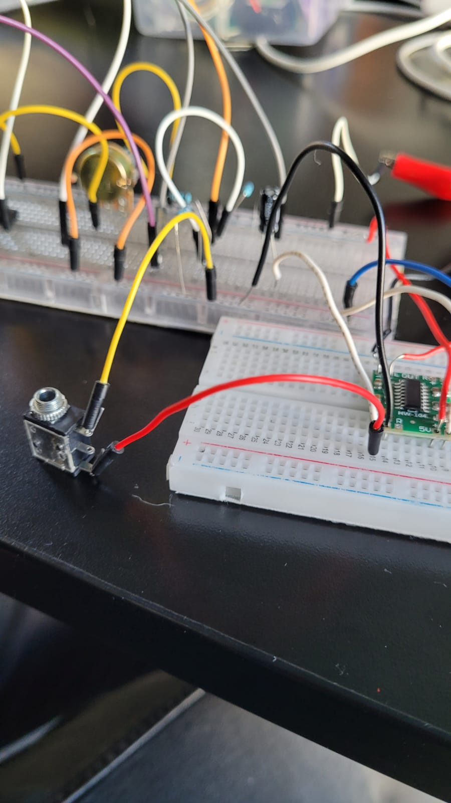

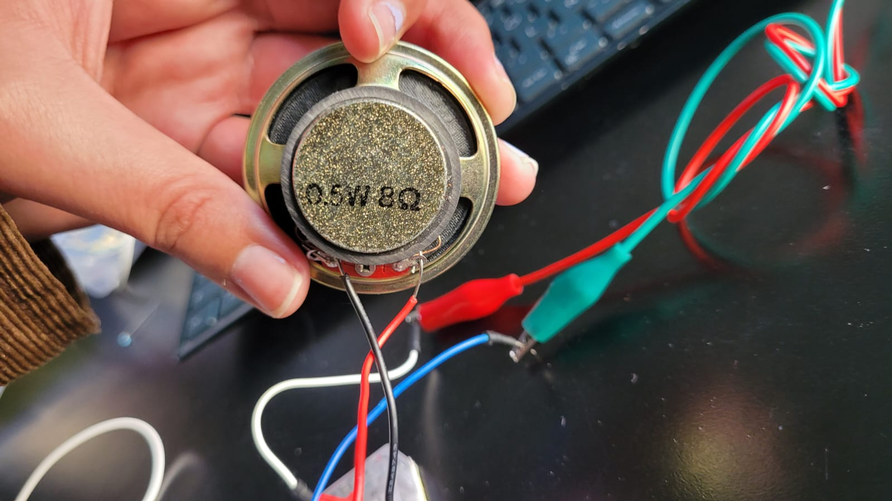

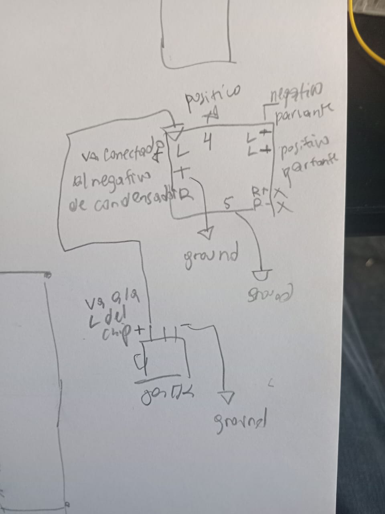

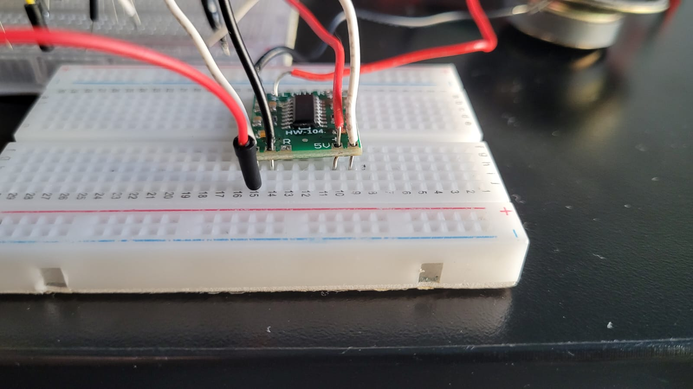

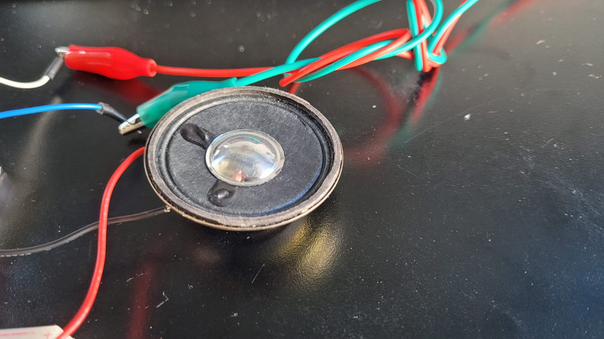

A continuación se presentan textos explicativos del prototipado.

El circuito de entrada usa un sensor piezoeléctrico para detectar impactos o vibraciones. Este componente convierte la energía mecánica tal como un golpe o presión, en una señal eléctrica.

La señal generada pasa por una red de resistencias y un divisor de voltaje, que acondiciona la señal para su correcto procesamiento. También se incluye un potenciómetro, que permite ajustar la sensibilidad del sistema frente a los estímulos físicos.

## Bill of Materials (1 punto)

| Componente                   | Cantidad | Comentarios         |
|-----------------------------|----------|----------------------|
| Chip                        | 1        | LM324               |
| Piezoeléctrico              | 1        |                      |
| Resistencia                 | 1        | 1M                   |
| Resistencia                 | 3        | 100k                 |
| Resistencia                 | 4        | 1k                   |
| Resistencia                 | 2        | 10k                  |
| Resistencia                 | 1        | 22k                  |
| Condensador polarizado     | 2        | 10uF                 |
| Potenciómetro              | 1        | 500k                 |
| Socket jack                | 1        | 3.5mm                |
| Parlante (Speaker)         | 1        | 8Ω                   |
| Jumpers (caimanes)         | 2        |                      |
| Fuente de alimentación     | 1        | 5V máx.              |
| Socket                     | 1        | Para LM324           |
| Conectores                 | -        |                      |
| Amplificador               | 1        | PAM8403              |

Fue necesario adquirir un sensor piezoeléctrico. Este componente fue clave para permitir la detección de percusiones o vibraciones en el dispositivo.

## Ayudas y comunicación con colegas (1 punto)

Con la ayuda y orientación de @disenoUDP/docentes pudimos salir del estancamiento al momento de prototipar el circuito de nuestro proyecto. Gracias a su acompañamiento, logramos que funcionara con fallos mínimos.

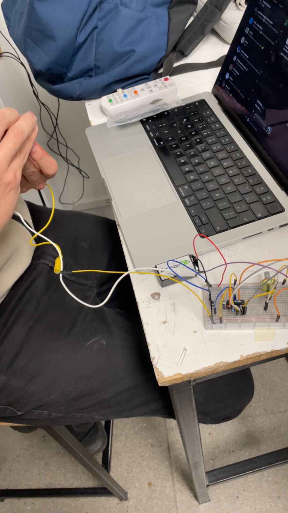

La primera vez que se armó la protoboard, el circuito no funcionaba correctamente, por lo que pedimos ayuda a @SebastianSaez1003. Su apoyo fue fundamental: nos ayudó a ordenar la protoboard y ofreció un feedback detallado sobre la conexión de los componentes. Al revisar paso a paso el esquemático y replicarlo en físico, pudimos entender mucho mejor el funcionamiento del circuito.

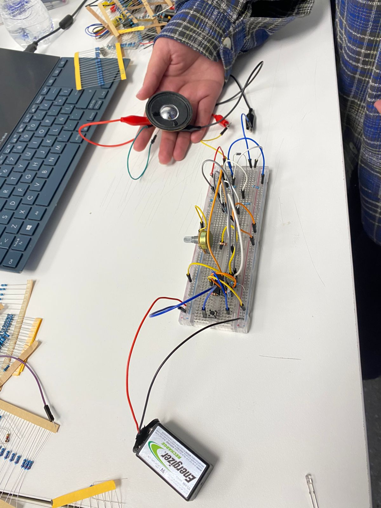

También @Bernardita-lobo y @jotamorales-romulus nos ayudaron a documentar visualmente nuestro proceso de prototipado: desde los errores iniciales hasta el resultado final.

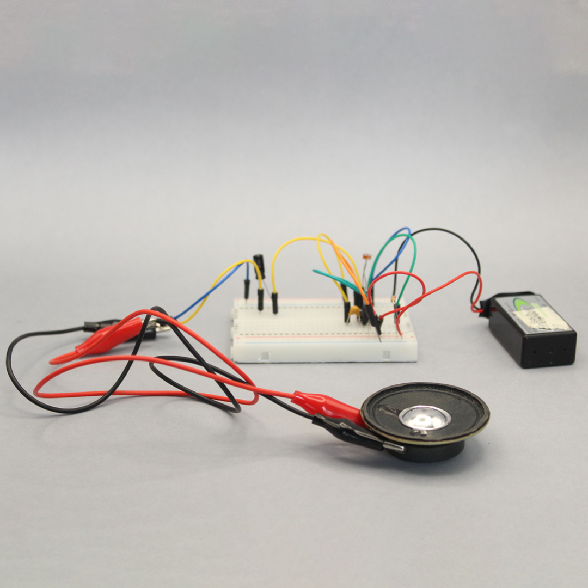

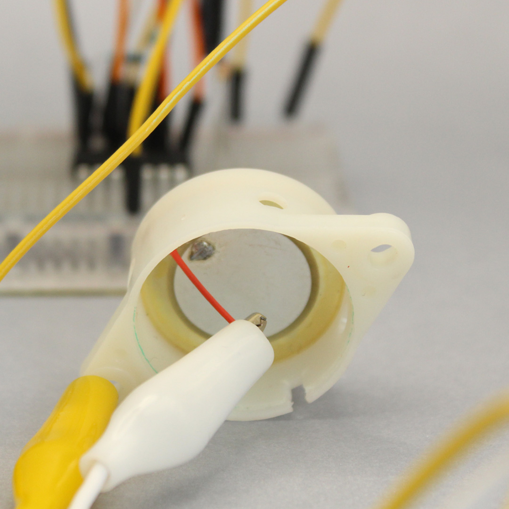

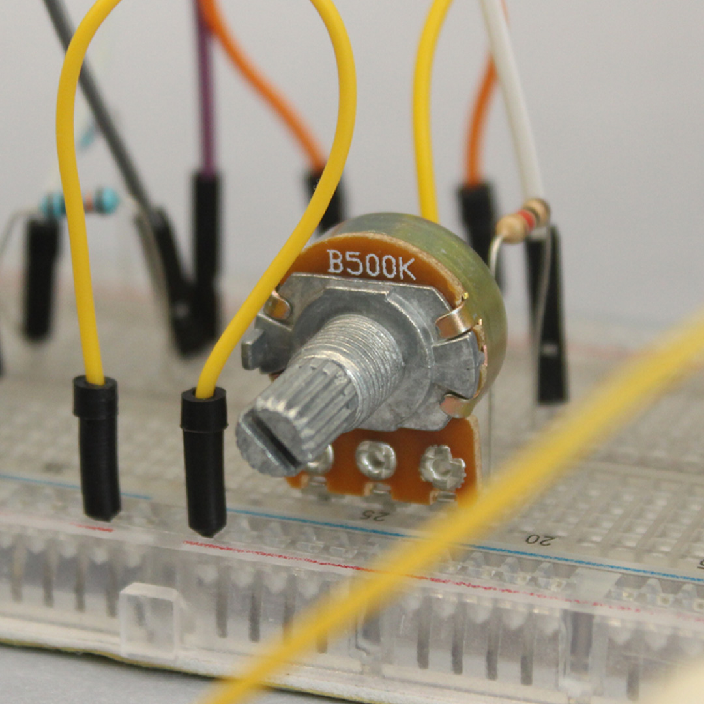

Con la ayuda de nuestro compañero @felix-rg416, pudimos comenzar a proyectar el diseño de la carcasa de nuestra máquina, algo que hasta ahora no teníamos completamente definido.

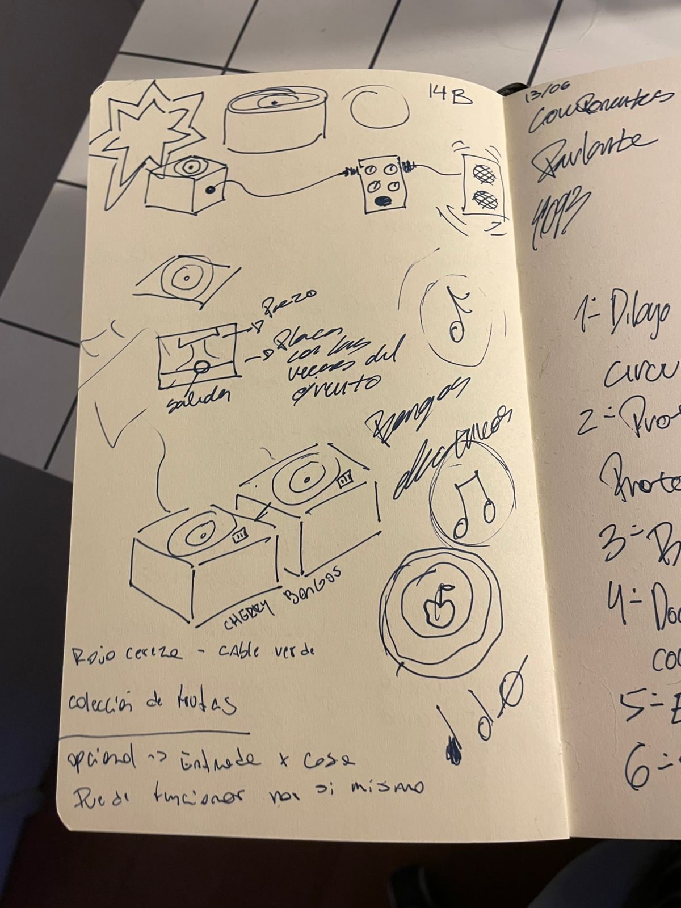

## Esquematico en Kicad (1 punto)

Con la ayuda de @misaaaaaa y @FranUDP pudimos resolver ciertas dudas que teníamos con respecto al esquemático y encontrar la mejor salida a esas problemáticas, tales como agregar ciertos símbolos y fue de mucha ayuda que nos dieran los links donde poder encontrarlos.

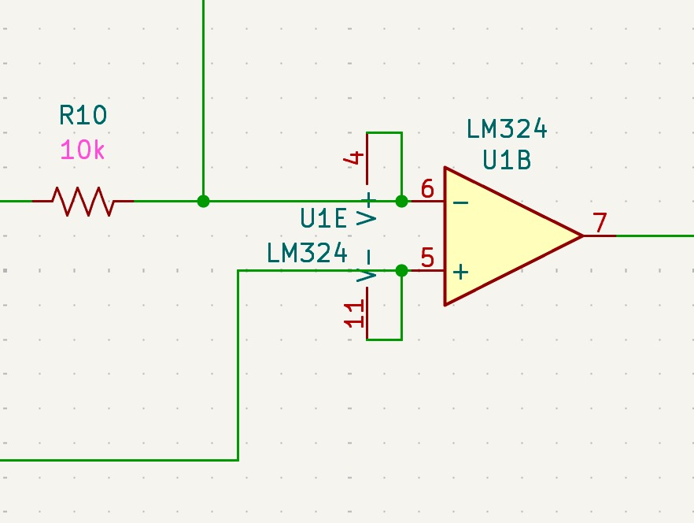

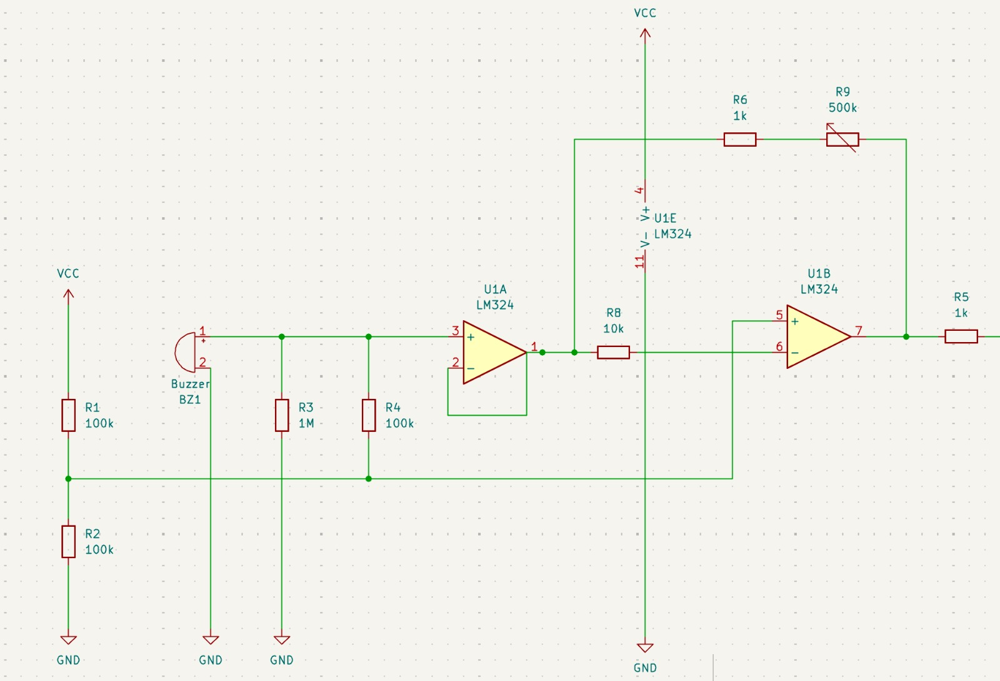

EXPLICACIÓN TEXTUAL DEL ESQUEMÁTICO.

DESCRIBIR CHIPS USADOS, CONEXIONES USADAS.

## PCB en Kicad (1 punto)

## Recursos adicionales

## Bibliografía
