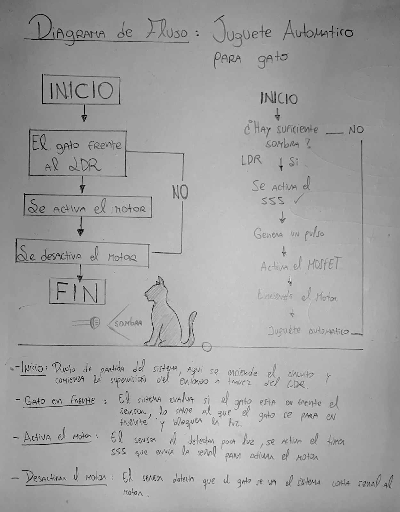
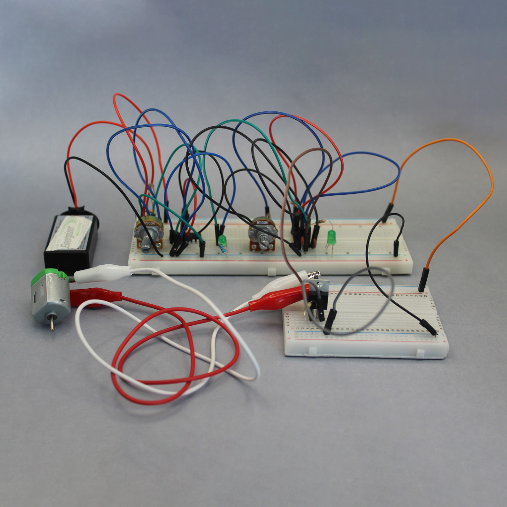
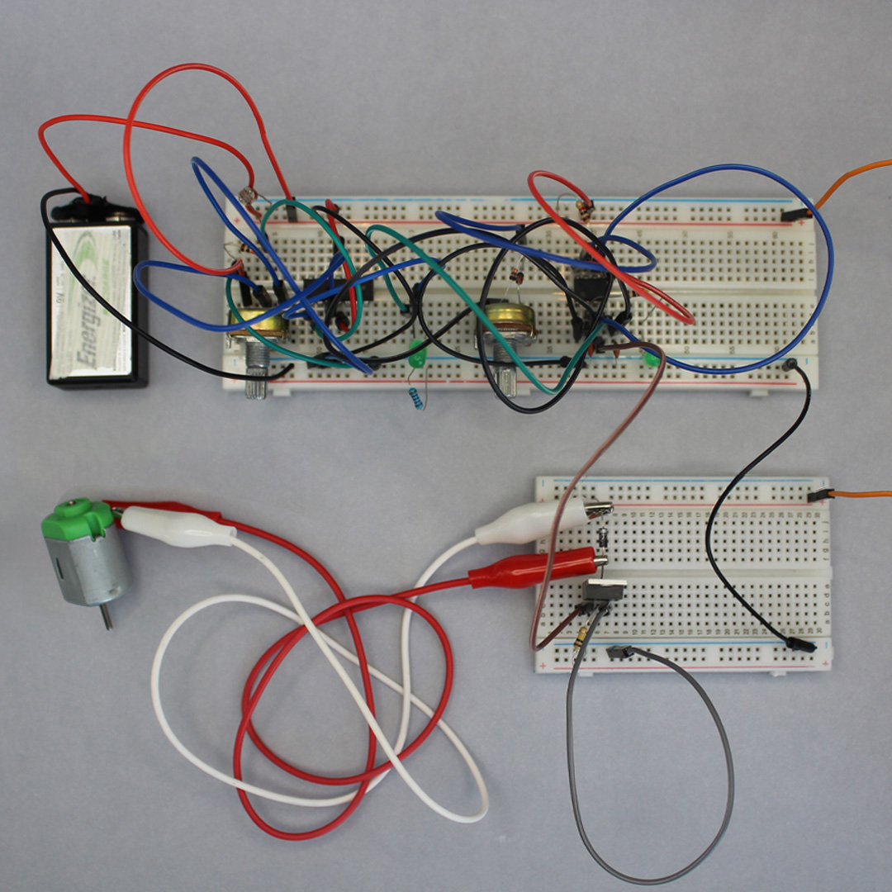
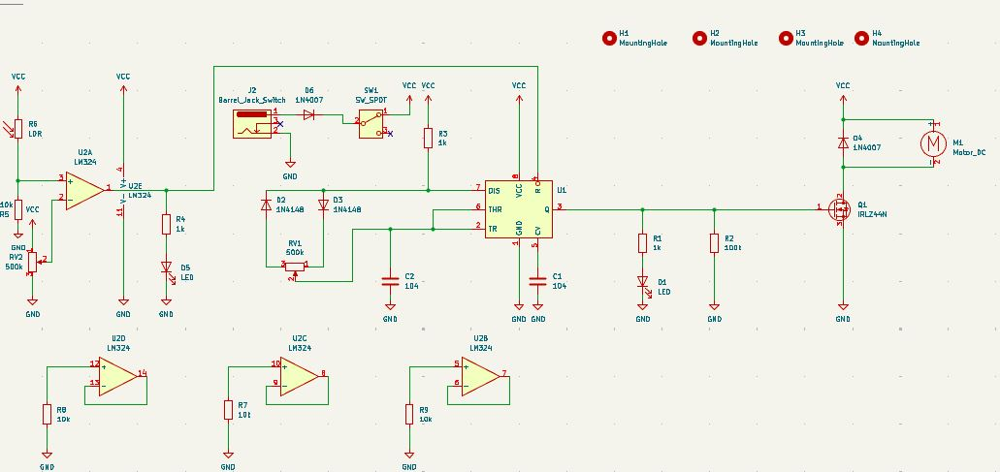
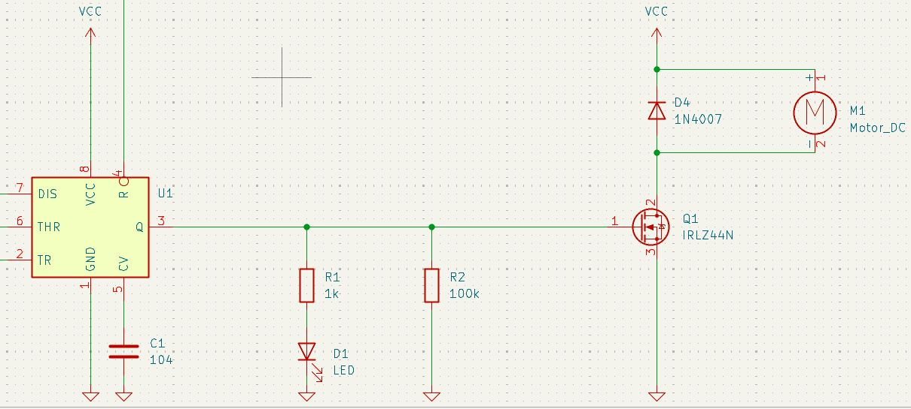
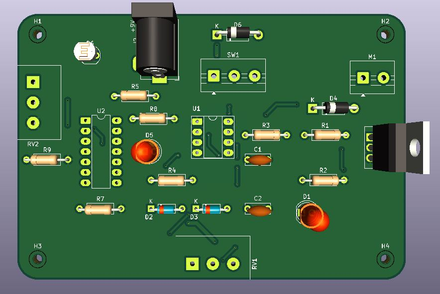

# proyecto-02

## Acerca del proyecto

- Grupo: 04
- Integrantes:
  - Braulio Figueroa
  - Carlo Martínez
  - Bastian Solís
- Chips usados:
  - Chip LM324
  - Chip NE555

## Presentación textual

El proyecto consiste en un juguete para gato que funciona con un LDR que controla la activación de un motor dc

## Dibujos de diagramas del circuito (1 punto)

Este es el diagrama a mano.

En este dibujo mostramos nuestro proyecto el cual consiste en un juguete automático para gatos que funciona con un sensor de luz (LDR). Cuando el gato se coloca frente al sensor, su sombra reduce la luz que llega al LDR, lo que activa el motor del juguete. Si el gato se aleja, vuelve a llegar luz al sensor, lo que hace que el motor se apague. Así, el juguete se enciende solo cuando el gato está presente y se apaga automáticamente cuando se va.

## Diagrama de Flujo (SIMPLE)

## Resumen del funcionamiento del juguete para gato (según el dibujo)

1. Inicio:
El sistema comienza en modo espera.

2. ¿El gato está frente al LDR?
Se detecta si hay sombra sobre el sensor de luz (LDR). Esto indica que el gato está cerca.

3. Si el gato está frente al sensor (hay sombra):
→ Se activa el motor del juguete para que se mueva.

4. Si el gato se va (hay luz):
→ Se desactiva el motor automáticamente.

5. Fin:
El sistema vuelve al inicio y espera una nueva detección.

## Diagrama de Flujo (DETALLADO)

## Funcionamiento General del Sistema

### 1. Detección de sombra (presencia del gato)

El sistema usa un sensor LDR (resistor dependiente de la luz) que mide la cantidad de luz ambiente.
Cuando hay luz normal, el sensor detecta niveles altos de luz.
Cuando el gato se acerca al juguete y lo tapa (proyectando sombra), el sensor detecta una baja de luz.

### 2. Activación del motor

Al detectar esa baja de luz, el sistema interpreta que el gato está presente.
Se activa un temporizador o lógica de control que enciende un motor DC.
Este motor puede mover una cuerda, una pluma u otro objeto que atraiga la atención del gato.

### 3. Desactivación automática

Cuando el gato se aleja del juguete, vuelve a llegar luz al sensor.
El sistema detecta el aumento de luz y apaga el motor automáticamente.
El juguete vuelve a estar en modo espera, listo para activarse nuevamente.

### Resumen del Comportamiento

| Situación                       | Sensor (LDR) detecta | Acción del sistema     |
|--------------------------------|----------------------|------------------------|
| Gato frente al sensor (sombra) | Poca luz             | Motor se enciende      |
| Gato se va                     | Luz normal           | Motor se apaga         |

## Prototipado de circuitos en protoboard (1 punto)

A continuación se presentan imágenes de las protoboards usadas.

A continuación se presentan textos explicativos del prototipado.

El circuito de entrada usa un LDR  para medir el umbral de luz que recibe la protoboard, este LDR va conectado a un chip lm324 que actúa como comparador de voltaje y a su vez un potenciómetro que actuará como un calibrador de la luz ya que las condiciones de luz pueden cambiar según el lugar que nos encontremos, por lo cuál esto se debe calibrar.

El circuito de salida usa XX para cambiar XX.

## Bill of Materials (1 punto)

| Grupo 4  |                                |   Integrantes    |                  |                          |                                     |
|:-------: |------------------------------- |:---------------: |----------------- |------------------------- |------------------------------------ |
|          | Braulio (brauliofigueroa2001)  | Carlo (zaaaiko)  | Bastían (HSB25)  |                          |                                     |
|          |                                |                  |                  |                          |                                     |
|          |                                |                  |                  |                          |                                     |
|   Item   |              Qty               |    Referencia    |      Valor       |       Tipo de ítem       |            Accesibilidad            |
|    1     |               5                |  R1,R2,R3,R4,R5  |       10k        |       Resistencia        |      Se puede conseguir en lab      |
|    2     |               2                |      R6, R7      |        1k        |       Resistencia        |      Se puede conseguir en lab      |
|    2     |               1                |        R8        |       100k       |       Resistencia        |      Se puede conseguir en lab      |
|    3     |               1                |        R9        |        1         |       Resistencia        |      Se puede conseguir en lab      |
|    4     |               2                |     RV1,RV2      |       500k       |       Potenciómetro       |      Se puede conseguir en lab      |
|    5     |               1                |       R10        |       LDR        |           LDR            |       Se tendrán que comprar        |
|    6     |               2                |      C1, C2      |       104n       |   Condensador cerámico   |      Se puede conseguir en lab      |
|    7     |               2                |      D1, D2      |      1N4148      |          Diodo           |       Se tendrán que comprar        |
|    8     |               2                |      D3, D4      |      1N4007      |          Diodo           |       Se tendrán que comprar        |
|    9     |               2                |      D5, D6      |     5mm Rojo     |           LED            |      Se puede conseguir en lab      |
|    10    |               1                |        U1        |      LM324       |          DIP-14          |       Se tendrán que comprar        |
|    11    |               1                |        U2        |      NE555       |          DIP-8           |      Se puede conseguir en lab      |
|    12    |               1                |       BT1        |      5V–9V       | Fuente de alimentación.  |      Se puede conseguir en lab      |
|    13    |               1                |        J1        |     2 pines      |      Terminal Block      |       Se tendrán que comprar        |
|    14    |               1                |        J2        |     3 pines      |      Terminal Block      |       Se tendrán que comprar        |
|    15    |               1                |       SW1        |       SPDT       |         Switch           |      Se puede conseguir en lab      |
|    16    |               1                |                  |        9v        |         Motor DC         |      Se puede conseguir en lab      |
|    17    |               1                |        Q1        |  MOSFET IRLZ44N  |        Transistor        | Se pueden usar los que nos pasaron  |
|    18    |               1                |        J3        | 5.5 mm estándar  |   Conector Barrel Jack   |       Se tendrán que comprar        |

## Ayudas y comunicación con colegas (1 punto)

DOCUMENTAR TEXTUAL, CON IMÁGENES, CON ENLACES A BITÁCORAS.

La persona 21 del proyecto 00 nos ayudó con pasar el BoM desde un Excel a MarkDown (Revisar su fork en la sesion 15b).

La persona XX del proyecto XX nos ayudó con XX.

Ayudamos a la persona XX del proyecto XX con XX.

Ayudamos a la persona XX del proyecto XX con XX.

## Esquematico en Kicad (1 punto)

EXPLICACIÓN TEXTUAL DEL ESQUEMÁTICO.

DESCRIBIR CHIPS USADOS, CONEXIONES USADAS.

## PCB en Kicad (1 punto)

## Recursos adicionales

## Bibliografía
