# proyecto-02

## Acerca del proyecto

- Grupo: 05
- Integrantes:
  - Antonia Cristi [@antocristi](https://github.com/antocristi)
  - Natalia Pilar [@sz-mada](https://github.com/sz-mada)
  - Paulina Vargas [@paulinavargasf](https://github.com/paulinavargasf)
- Chips usados:
  - Chip LM324
  - Chip NE555
  - Chip CD4017

## Presentación textual

Ruleta de luces que se activa mediante la detección del sombra y voz del usuario, leyendo su vibra.

El proyecto consiste en una entrada con un LDR que detecta sombra, con una salida de secuencia de luces LED que se encienden.

## Dibujos de diagramas del circuito (1 punto)

Este es el diagrama a mano.

En este dibujo mostramos XX.

## Prototipado de circuitos en protoboard (1 punto)

A continuación se presentan imágenes de las protoboards usadas.

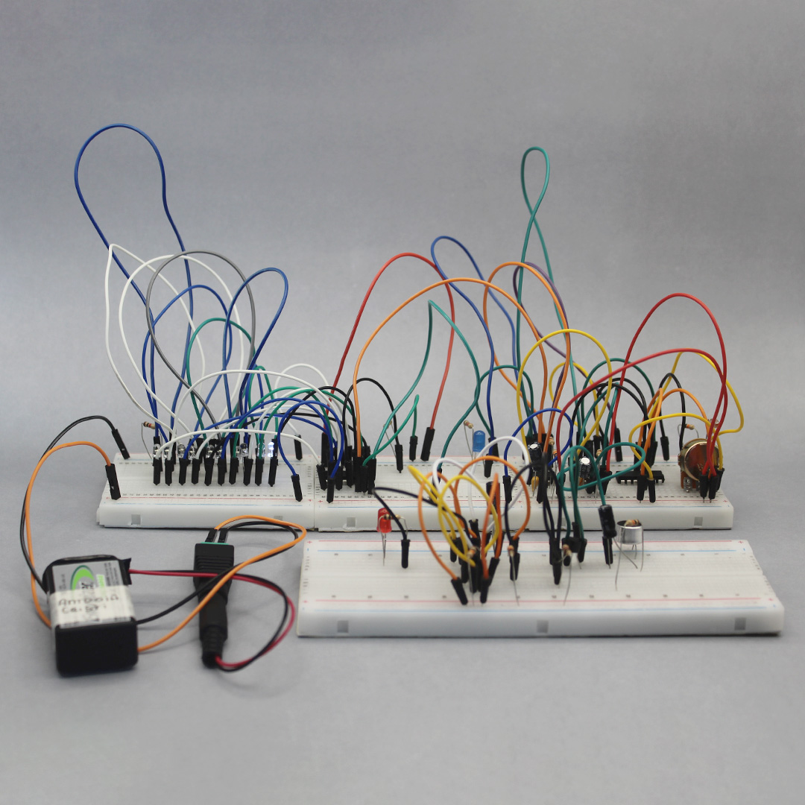

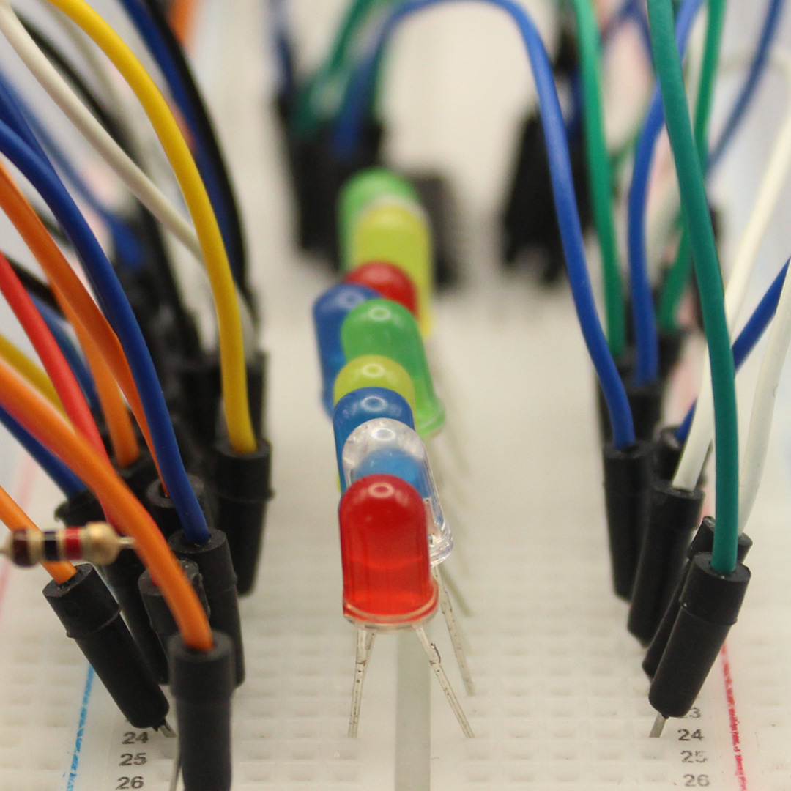

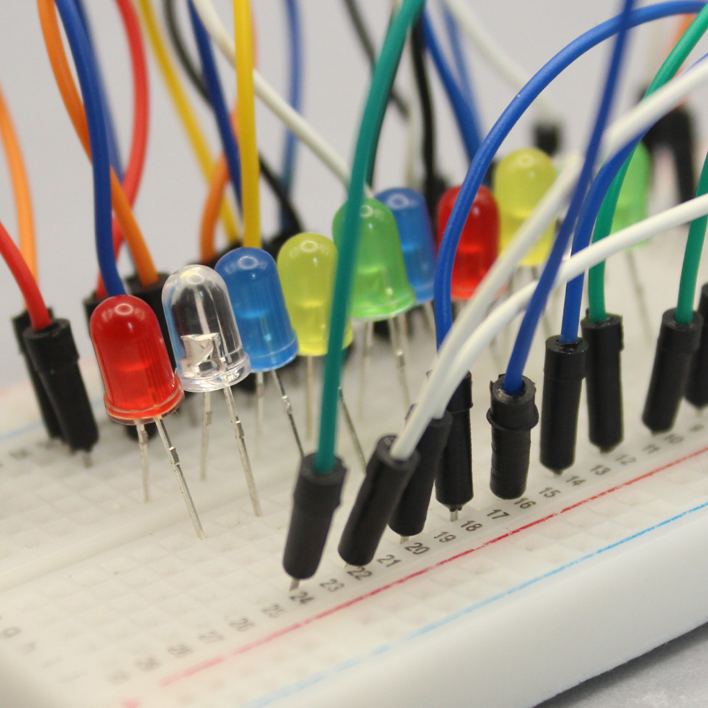

A continuación se presentan textos explicativos del prototipado.

El circuito de entrada usa un LDR para medir la entrada de luz, el umbral de esta se controla por medio de un potenciómetro.

El circuito de salida usa un chip CD4017 para activar una secuencia de 10 luces LED.

## Bill of Materials (1 punto)

|QTY|REFERENCE|VALUE|FOOTPRINT|OBS
|:-:|-|-|-|-
|3|U1,U4,U5|-|Socket 8-pin|-
|1|U2|-|Socket 14-pin|-
|1|U3|-|Socket 18-pin|-
|7|R2,R3,R4,R5,R8,R10,R11|10k|Resistencia|-
|3|R7,R9,R12|1k|Resistencia|-
|1|R6|100k|Resistencia|-
|1|R1|LDR|LDR|-
|3|C1,C4,C7|474n|Condensador cerámico|474
|1|Q1|PN2222A|Transistor|-
|1|MK1|MIC|Micrófono electret|-
|3|C3,C5,C6|1u|Condensador electrolítico|-
|1|C2|100u|Condensador electrolítico|-
|11|D1~D11|LED|LED 5mm|Distintos colores
|1|RV1|500k|Potenciómetro|-
|3|U1,U4,U5|NE555|DIP-8|Van en los socket U1, U4, y U5
|1|U2|LM324|DIP-14|Va en el socket U2
|1|U3|CD4017|DIP-16|Va en el socket U3

## Ayudas y comunicación con colegas (1 punto)

[FranUDP](https://github.com/FranUDP) del grupo 0c nos ayudó al principio del protipado recomendándonos comenzar a usar el circuito del detector de sombra.

[Misaa](https://github.com/misaaaaaa) (docente) nos entregó el esquemático de un circuito que utiliza un micrófono para la entrada y de salida enciende un LED.

[FranUDP](https://github.com/FranUDP) del grupo 0c nos ayudó agregando un circuito astable entre nuestro chip LM324 y el NE555 monostable que teníamos.

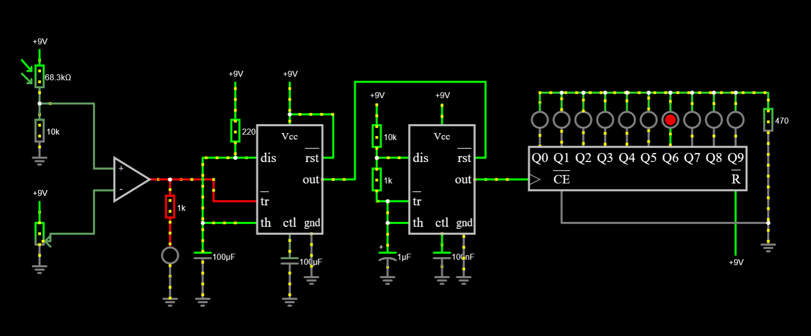

Intentamos ayudar a [Sofía Cartes](https://github.com/sofiacartes) del proyecto 03 en cómo regular la sensibilidad del micrófono de su circuito. Le dijimos que podrían conectar el pin 15 del chip 4017 a tierra, pero no se resolvió el problema.

[Issue #137 del proyecto 03](https://github.com/disenoUDP/dis8644-2025-1-proyectos/issues/137#issuecomment-2984472409)

## Esquematico en Kicad (1 punto)

[Esquemático en formato PDF](./imagenes/esquematico-05.pdf)

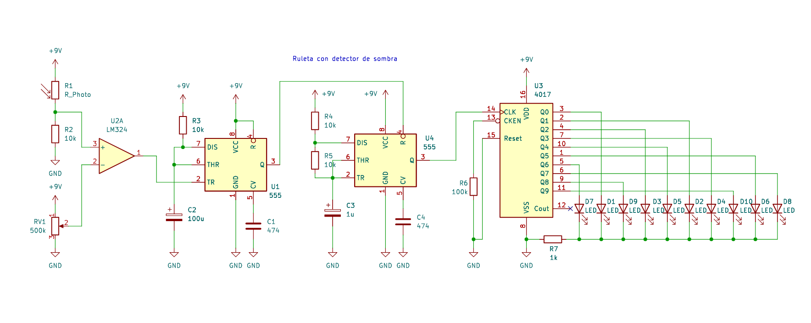

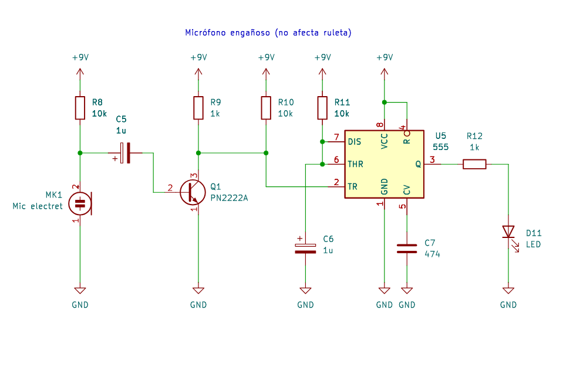

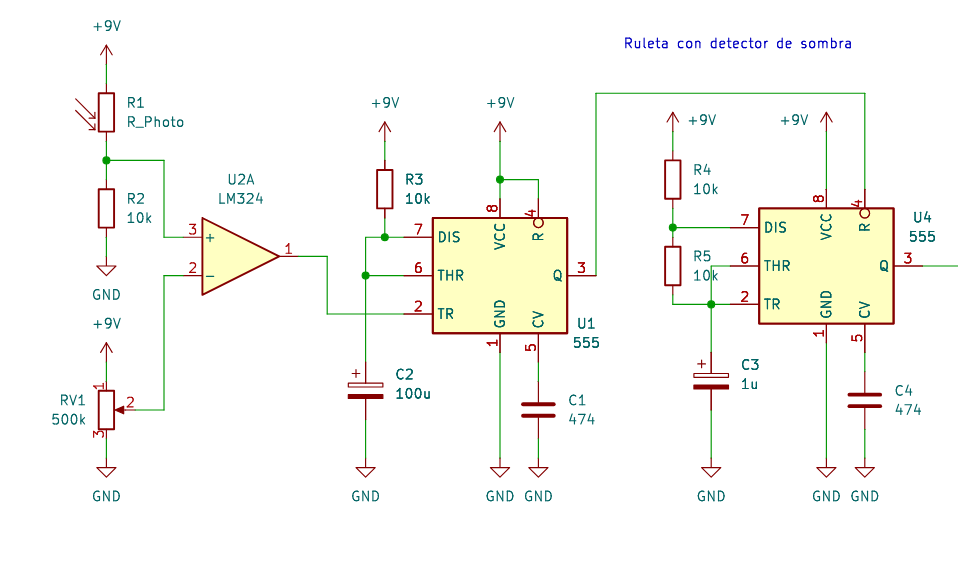

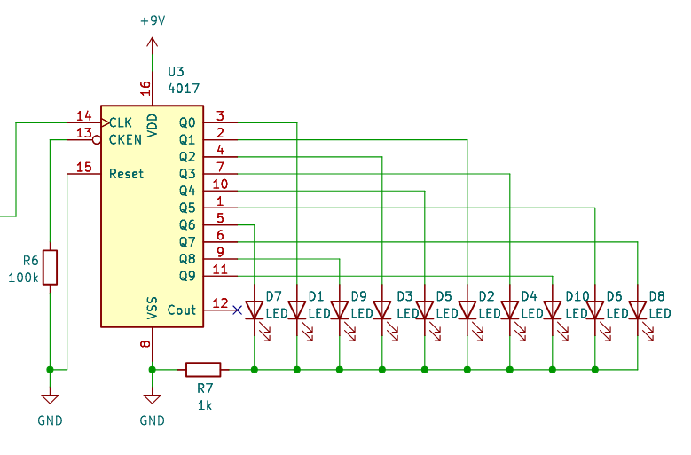

El esquemático utiliza un sensor de luz, comparador, dos temporizadores 555 y un contador 4017 para activar una secuencia de LEDs de forma controlada por la presencia de sombra.

El detector de sombra funciona por medio de una fotoresistencia que detecta luz, un potenciómetro forma un divisor de voltaje que establece un umbral ajustable, y un chip LM324 que actúa como comparador; la salida es baja si hay luz, y alta si hay sombra.

El circuito sigue con un chip NE555 monostable que genera un pulso cada vez que cambia la salida del comparador, el cual actúa como interruptor que habilita temporalmente el oscilador del siguiente chip NE555 astable.

Seguido por un contador 4017, cada salida alta enciende un LED en secuencia. Cada vez que se detecta sombra &rarr; se genera un pulso &rarr; el contador avanza &rarr; un LED se enciende.

## PCB en Kicad (1 punto)

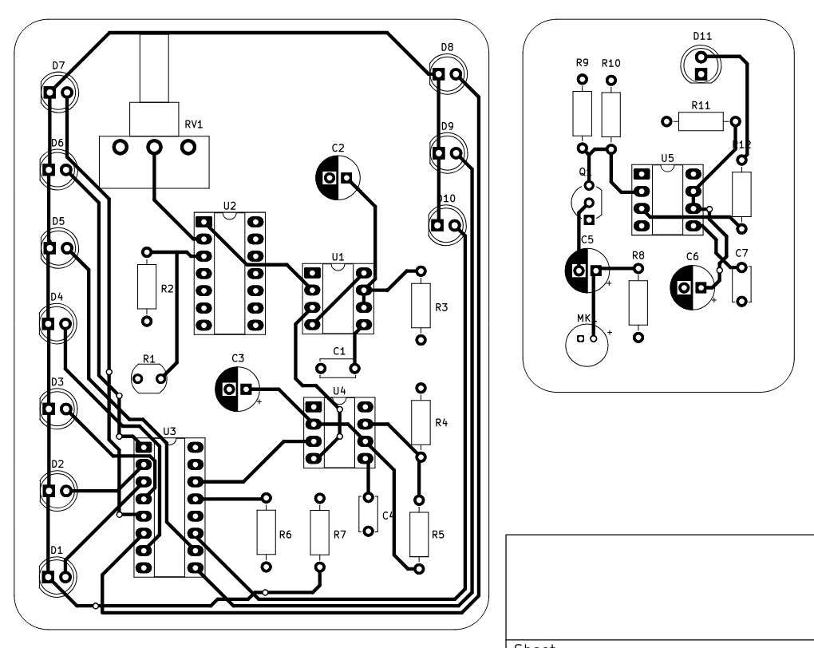

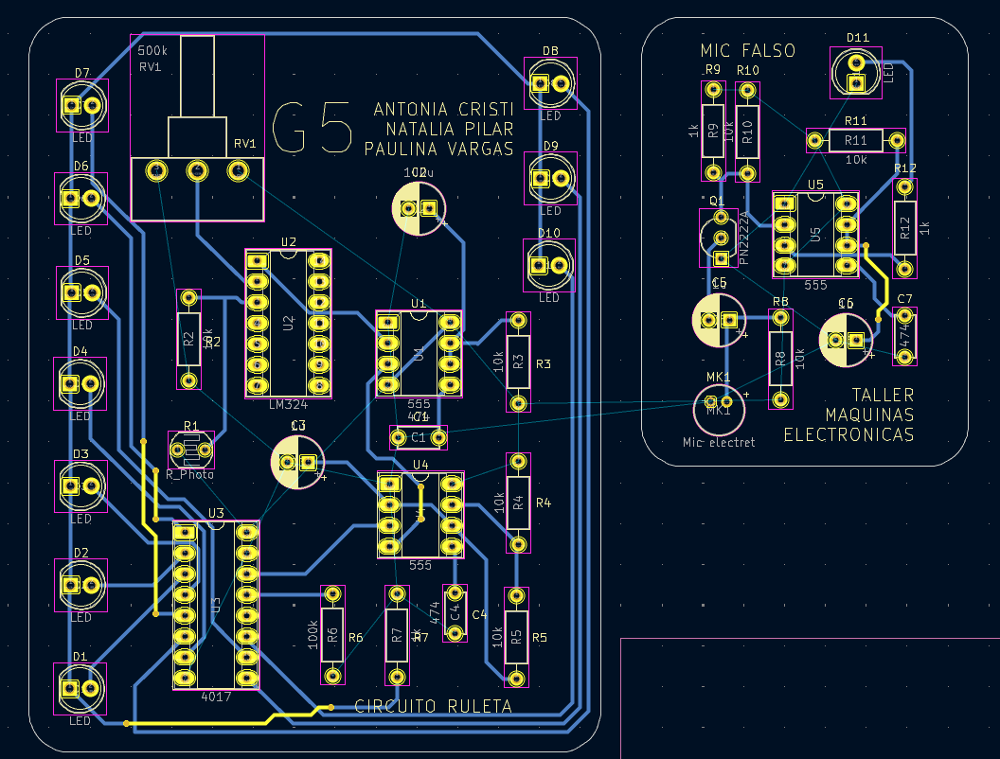

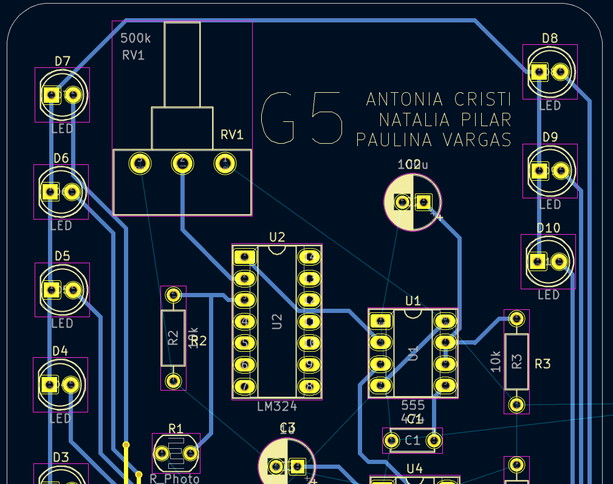

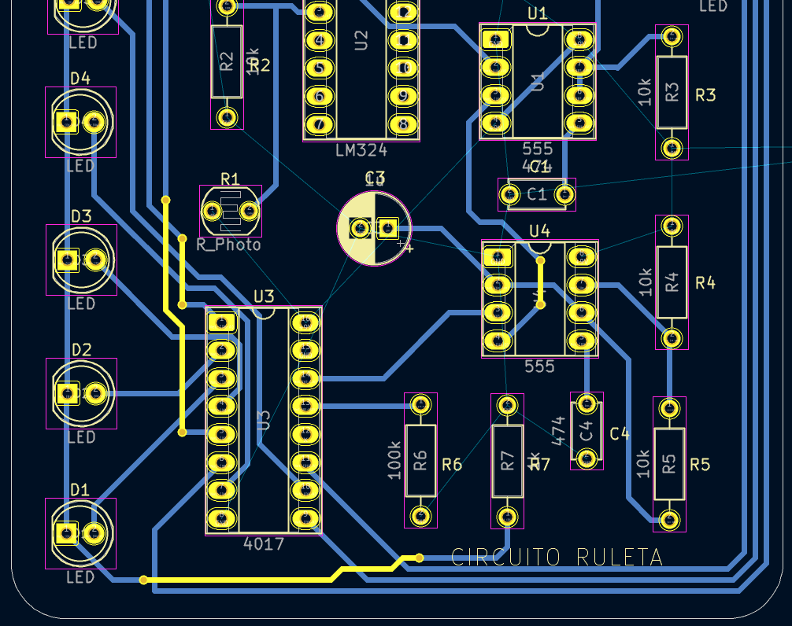

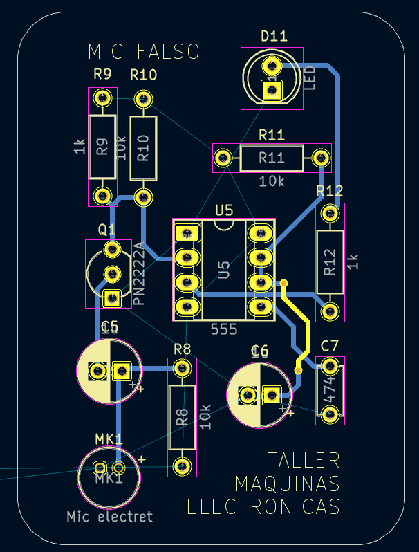

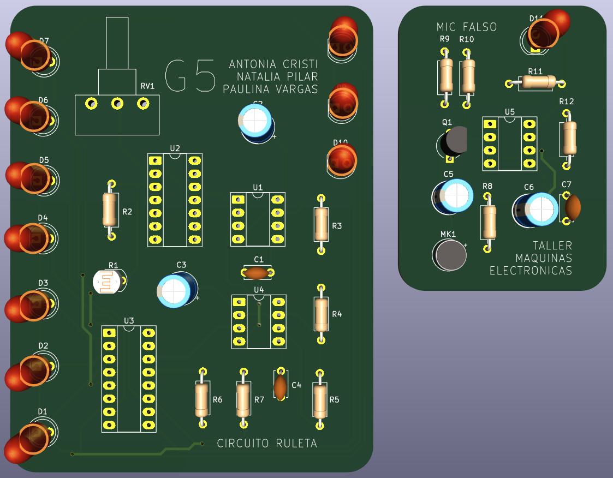

## Recursos adicionales

[Circuito de 555 Timer Circuits que usamos como referencia originalmente](https://www.555-timer-circuits.com/roulette.html)

## Bibliografía

[Tutorial de cómo diseñar una placa PCB](https://www.youtube.com/watch?v=kccAeKYytE8)

[Datasheet del chip CD4017](https://www.makerhero.com/img/files/download/CD4017-Datasheet.pdf)

[Datasheet del chip NE555](https://www.ti.com/lit/ds/symlink/ne555.pdf)

[Datasheet del chip LM324](https://www.ti.com/lit/ds/symlink/lm324.pdf)
