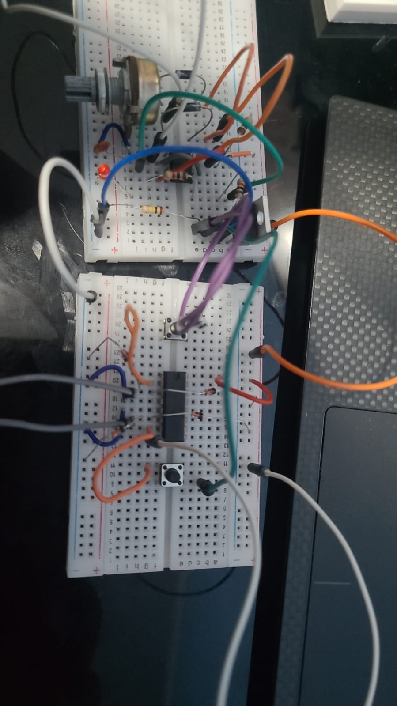
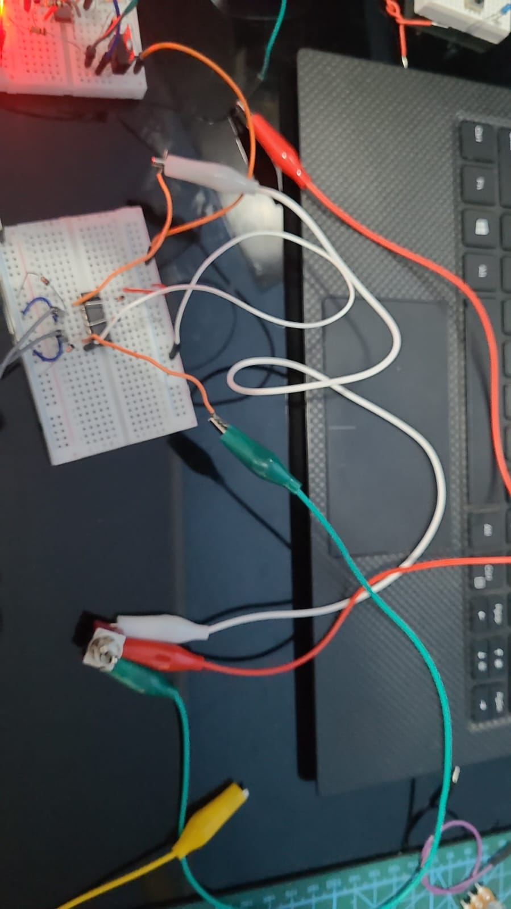
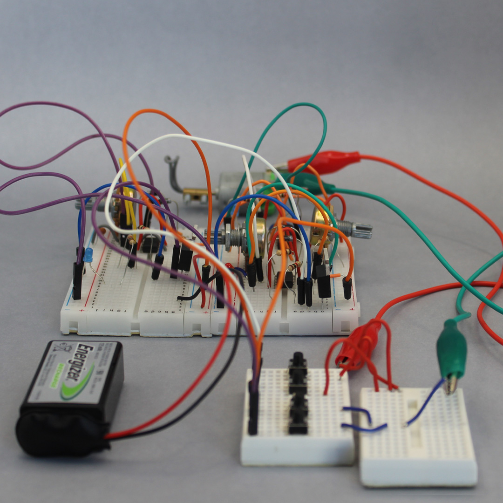
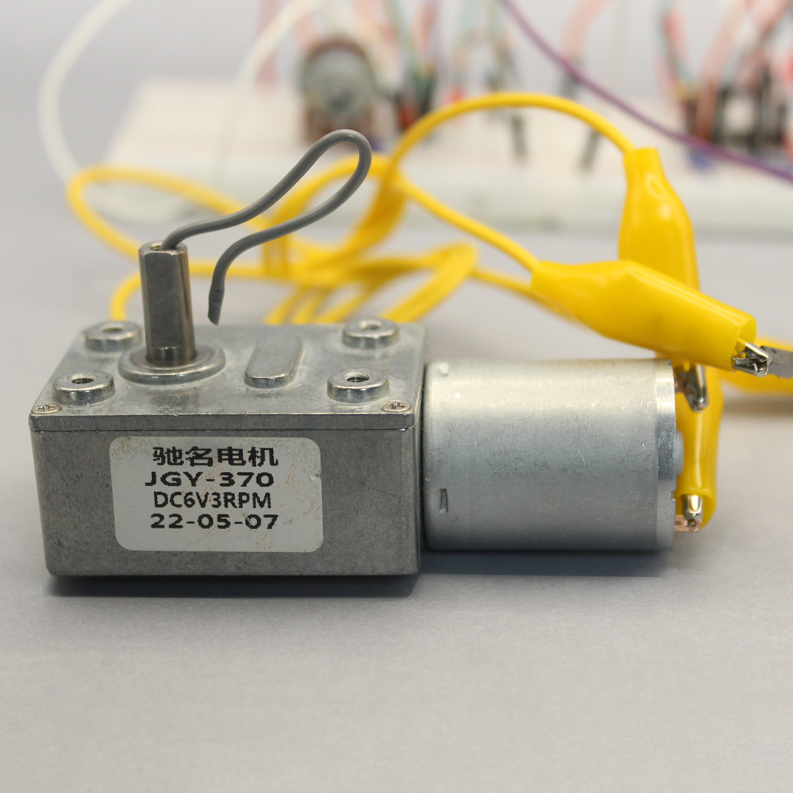

# proyecto-02

## Acerca del proyecto

- Grupo: 06
- Integrantes:
  - Santiago Gaete Fernández
  - Anaís Marschhausen Gajardo
  - Sebastián Saez Olivares
- Chips usados:
  - NE555
  - L293D

## Presentación textual

fps555 es un dispositivo de protección ocular con posición adaptable mecánicamente. consiste en un circuito que recibe un input a través de un interruptor on-off-on. esta acción provoca un output de rotación mecánico, ajustando la posición de los lentes

## Dibujos de diagramas del circuito (1 punto)

Este es el diagrama a mano.

En este dibujo mostramos XX.

## Prototipado de circuitos en protoboard (1 punto)

En un principio queríamos que nuestro circuito funcionara gracias a un servomotor para crear un movimiento controlado al interactuar con nuestro producto, pero no funcionó ningún circuito que encontramos en internet, y los que sí funcionaban requieren Arduino para su funcionamiento.

A continuación, un video de todos los componentes y la protoboard que habíamos armado:

Luego Matías nos explicó sobre los puentes H, donde podíamos controlar la velocidad y la dirección del movimiento de un motor como el que se encontraba en nuestro kit.

También se nos mencionó que existe un chip integrado que realizaba esta función, pero de igual manera se hizo una prueba del circuito de manera mecánica, con 4 botones, a que era lo que más se asemejaba al esquemático del puente H a primera vista.

El funcionamiento era el siguiente:

Se armaron 2 circuitos PWM donde su output eran conectados hacia botones, donde el circuito 1 quedaría posicionado con su output al positivo del motor, mientras que a través de otro botón se dejaría pasar la conexión para completar el circuito, mientras que el circuito 2 estaría de la manera opuesta, todo esto para que no ocurriese ningún cortocircuito.

Video de prueba del puente H con 4 botones, hecho de manera mecánica:

Luego pasamos a integrar el chip L293D con el que se pudo reducir su funcionamiento a simplemente 2 botones, uno para cada dirección del motor.

Video de prueba del chip al tener 2 botones:

Luego se integró el switch 6 PDT para poder generar este cambio de dirección con tan solo 1 componente, como también el estado neutro “off” del motor.

Pero se nos dejó claro en la clase del martes 17 de junio unas ciertas correcciones, para poder asegurarnos de que el L293D estaba correctamente conectado, como también el uso de la otra mitad de nuestro switch on/off/on, y que de esta manera no se fuese a ocupar todo el circuito de manera constante al conectarlo al pin 4 del chip 555.

Como último componente, se conectó el motor reductor de 3 rpm que compramos, para poder demostrar el funcionamiento como lo asignamos.

Video del funcionamiento de la protoboard final:

Como resumen:

El circuito de entrada usa la posición del switch para determinar el estado del motoreductor.

El circuito de salida usa el L293D para cambiar el sentido de la rotación del motoreductor.

## Bill of Materials (1 punto)

bom extraído desde [repo de duckusu](https://github.com/Anaisbmg/dis8644-2025-1-proyectos/tree/main/21-duckusu/sesion-15b)

| Grupo 6 	|                         	|          Integrantes          	|                   	|                                                 	|                                                            	|
|:-------:	|-------------------------	|:-----------------------------:	|-------------------	|-------------------------------------------------	|------------------------------------------------------------	|
|         	| Santiago (clifford1one) 	| Sebastián (SebastianSaez1003) 	|  Anaís (Anaisbmg) 	|                                                 	|                                                            	|
|         	|                         	|                               	|                   	|                                                 	|                                                            	|
|         	|                         	|                               	|                   	|                                                 	|                                                            	|
|   Item  	|           Qty           	|           Referencia          	|       Valor       	|                   Tipo de ítem                  	|                        Accesibilidad                       	|
|    1    	|            2            	|             R1, R2            	|         1K        	|                   Resistencia                   	|                  Se puede conseguir en lab                 	|
|    2    	|            2            	|             R3, R4            	|        100K       	|                   Resistencia                   	|                  Se puede conseguir en lab                 	|
|    3    	|            2            	|             R5, R6            	|        470K       	|                   Resistencia                   	|                  Se puede conseguir en lab                 	|
|    4    	|            1            	|               R7              	|        10KΩ       	|                   Resistencia                   	|                  Se puede conseguir en lab                 	|
|    5    	|            6            	|             D1~D6             	|       1n4007      	|                      Diodo                      	|                   Se tendrán que comprar                   	|
|    6    	|            1            	|               C1              	|        104        	|              Condensador (cerámico)             	|                  Se puede conseguir en lab                 	|
|    7    	|            1            	|               C2              	|        474        	|              Condensador (cerámico)             	|        Se puede conseguir en lab pero no hay muchos        	|
|    8    	|            1            	|               D7              	|        3mm        	|                       Led                       	|                  Se puede conseguir en lab                 	|
|    9    	|            1            	|               U1              	|        555        	|                       Chip                      	|                  Se puede conseguir en lab                 	|
|    10   	|            1            	|               U2              	|       L293D       	|                       Chip                      	|                   Se tendrán que comprar                   	|
|    11   	|            1            	|              SW1              	| 6 Pines ON-OFF-ON 	|                Interruptor Switch               	|                    Comprado (katode.cl)                    	|
|    12   	|            1            	|                               	|      6V 3RPM      	|                 Motorreductor DC                	|                     Comprado (Afel.cl)                     	|
|    13   	|            1            	|              RVC1             	|        500K       	|                  Potenciometro                  	|                  Se puede conseguir en lab                 	|
|    14   	|            2            	|                               	|      2 pines      	|                      Tblock                     	| Se tendrán que comprar si es que no usan los que ya tienen 	|
|    15   	|            1            	|               U1              	|      8 pines      	|                      Socket                     	|                  Se puede conseguir en lab                 	|
|    16   	|            1            	|               U2              	|      16 pines     	|                      Socket                     	|                   Se tendrán que comprar                   	|
|    17   	|            5            	|                               	|                   	|                    Pin Header                   	|                  Se puede conseguir en lab                 	|
|    18   	|            5            	|                               	|                   	| Cable dupont: terminal receptora a terminal pin 	|                  Se puede conseguir en lab                 	|

compramos 3 interruptor switch de 6 Pines ON-OFF-ON y tambien 1 motorreductor DC de 6V 3RPM, para más info issue 04

## Ayudas y comunicación con colegas (1 punto)

### protoboards 

[issue protoboards](https://github.com/orgs/disenoUDP/projects/4/views/1?pane=issue&itemId=115280226&issue=disenoUDP%7Cdis8644-2025-1-proyectos%7C140)

- [issue 01](https://github.com/disenoUDP/dis8644-2025-1-proyectos/issues/140#issuecomment-2985358277)  
   - emisor: SebastianSaez1003  
   - enviado a: docentes 
   - temática: documentación de proto en el proceso  
   - conclusión: era necesario documentar todo el progreso para entender el proceso de aprendizaje  

- [issue 02](https://github.com/disenoUDP/dis8644-2025-1-proyectos/issues/140#issuecomment-2986736213)  
   - emisor: SebastianSaez1003
   - enviado a: IzhakVillegas y docentes
   - temática: feedback de formato
   - conclusión: no hemos recibido respuesta

### bom 

[issue bom](https://github.com/orgs/disenoUDP/projects/4/views/1?pane=issue&itemId=115280715&issue=disenoUDP%7Cdis8644-2025-1-proyectos%7C146)

- [issue 03](https://github.com/disenoUDP/dis8644-2025-1-proyectos/issues/146#issuecomment-2982287337)  
   - emisor: anaisbmg  
   - enviado a: franudp del grupo 0c y docentes 
   - temática:  recomendación para conectar switch 6 pines
   - conclusión: existen nudos para cables y que podriamos utlizar resina uv o silicona para cubrir las conexiones y sí utilizábamos tblock deberíamos ocupar terminales para aislar 

- [issue 04](https://github.com/disenoUDP/dis8644-2025-1-proyectos/issues/146#issuecomment-2986084119)  
   - emisor: anaisbmg   
   - enviado a: duckusu del grupo 0c y docentes
   - temática: pin header y bom
   - conclusión: se confirmo nuestra idea de comprar una regleta y utilizar 5 pin, tambien existen de estos pin header en el lab
  

### esquematico 

[issue esquemático](https://github.com/orgs/disenoUDP/projects/4/views/1?pane=issue&itemId=115278736&issue=disenoUDP%7Cdis8644-2025-1-proyectos%7C128)

- [issue 05](https://github.com/disenoUDP/dis8644-2025-1-proyectos/issues/128#issuecomment-2978671139)  
   - emisor: SebastianSaez1003
   - enviado a: franudp del grupo 0c y docentes
   - temática: interacción previa
   - conclusión: es más rápido etiquetar a @disenoUDP/docentes que estar etiquetando uno a uno y nos ayudaron con correcciones para nuestro esquemático
     
- [issue 06](https://github.com/disenoUDP/dis8644-2025-1-proyectos/issues/128#issuecomment-2981096977)  
   - emisor: clifford1one
   - enviado a: franudp del grupo 0c y docentes
   - temática: feedback símbolo para el mts303 de 6 pines
   - conclusión: existe una guía para KiCAD llamada sparkfun y se nos guío con el componente y este como estaba en la footprint

- [issue 07](https://github.com/disenoUDP/dis8644-2025-1-proyectos/issues/128#issuecomment-2989092959)  
   - emisor: clifford1one   
   - enviado a: franudp del grupo 0c y docentes
   - temática: feedback respecto a la diagramación
   - conclusión: esta hermoso y que podríamos añadir cajas de texto, lo cual se profundizará para el examen

### pcb 

[issue pcb](https://github.com/orgs/disenoUDP/projects/4/views/1?pane=issue&itemId=115279178&issue=disenoUDP%7Cdis8644-2025-1-proyectos%7C134)

- [issue 08](https://github.com/disenoUDP/dis8644-2025-1-proyectos/issues/134#issuecomment-2986132101)  
   - emisor: SebastianSaez1003  
   - enviado a: franudp del grupo 0c y docentes
   - temática: opiniones de pcb
   - conclusión: si hace alusión al sol, seria muy redundante, pero destacamos forma de lentes hacia atrás, 

- [issue 09](https://github.com/disenoUDP/dis8644-2025-1-proyectos/issues/134#issuecomment-2986654634)  
   - emisor: clifford1one   
   - enviado a: franudp del grupo 0c y docentes
   - temática: screw terminal y vector de lente
   - conclusión: toda la fuente de poder tuviera el mismo voltaje (9v) y footprints de la batería estan bien.

- [issue 10](https://github.com/disenoUDP/dis8644-2025-1-proyectos/issues/134#issuecomment-2989105082)  
   - emisor: clifford1one 
   - enviado a: franudp del grupo 0c y docentes
   - temática: error con drc
   - conclusión: la pagina de jlcpcb salen las dimensiones mínimas para cada perforación, separación.

### carcasas 

[issue carcasas](https://github.com/orgs/disenoUDP/projects/4/views/1?pane=issue&itemId=116136542&issue=disenoUDP%7Cdis8644-2025-1-proyectos%7C554)

- [issue 11](https://github.com/disenoUDP/dis8644-2025-1-proyectos/issues/554#issuecomment-2989115405)  
   - emisor: felix-rg416  
   - enviado a: grupo 06 y docentes
   - temática: medidas de pcb
   - conlusión: la pcb mide 100x50mm y también adjuntamos el repo en donde podrían ver la información completa

## Esquematico en Kicad (1 punto)

EXPLICACIÓN TEXTUAL DEL ESQUEMÁTICO.

DESCRIBIR CHIPS USADOS, CONEXIONES USADAS.

## PCB en Kicad (1 punto)

## Recursos adicionales

## Bibliografía
