# proyecto-02-grupo-0a

## Acerca del proyecto

Integrantes:

- Félix Rodríguez Guevara: [felix-rg416](https://github.com/felix-rg416/dis8644-2025-1-proyectos)
- Alanis Vásquez Jara: [AlanisMria](https://github.com/AlanisMria/dis8644-2025-1-proyectos)

## Medidas de placas PCB de cada proyecto (1 punto)

### Medidas de placas PCB del proyecto-01

Son 4 PCBs de 2 tamaños distintos:

- 3 PCBs de 15x100mm
- 1 PCB de 40x100mm

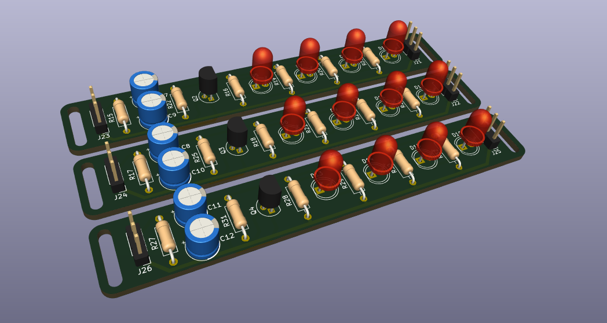

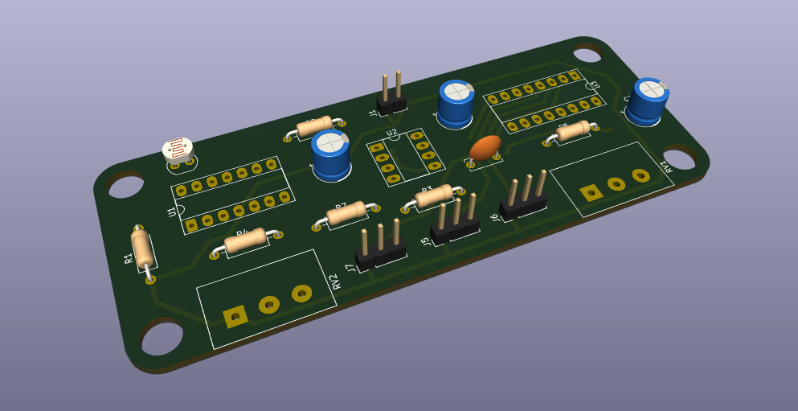

### Medidas de placas PCB del proyecto-02

Su proyecto es un bombo eléctrico. Recibe señal mediante un piezo eléctrico y genera sonido.

Una de sus PCB es un círculo 100mm de diámetro

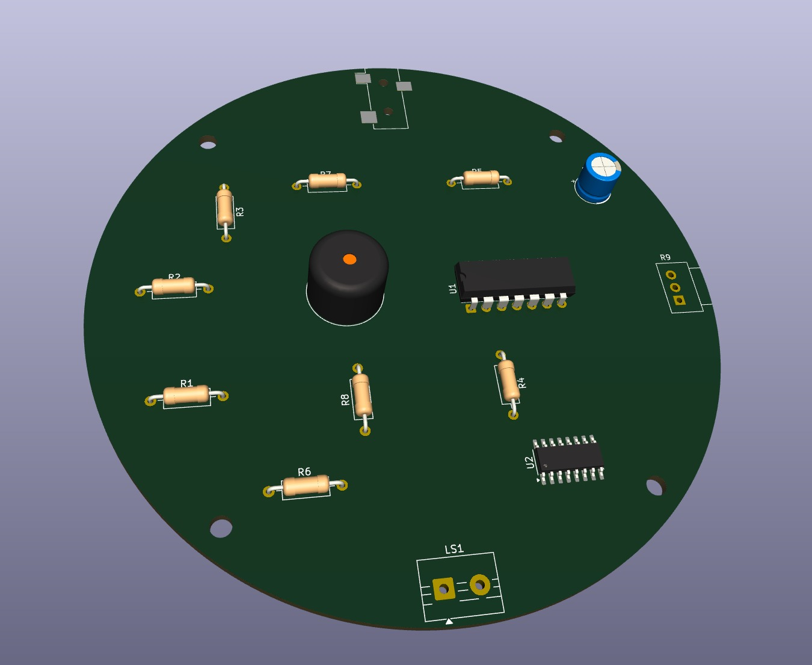

Los dibujos son hechos por el grupo-02

### Medidas de placas PCB del proyecto-03

El proyecto es una esfera que emite luz a partir de la recepción de sonido.

Quieren que sea una esfera de capas de acrílico de colores. En total de unos 150 a 200mm de diámetro. Dentro estaría la pcb afirmada por una base de impresión 3D.

Las medidas de su pcb son: 95 mm x 55 mm

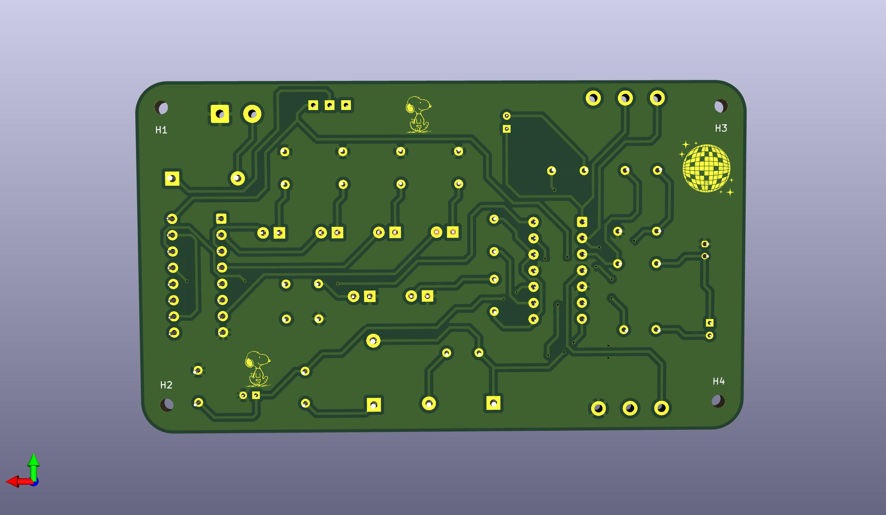

### Medidas de placas PCB del proyecto-04

Juguete de gato "tamaño gato". Detecta al gato con un LDR y hace girar un motor que mueve un juguete para entretener al gatito.

Piensan en una base tipo rampa que detecte al gatito y arriba un brazo que tenga el juguete colgando.

Un juguete para gato con LDR y un motor. Las medidas son: 95mm x 65 mm

### Medidas de placas PCB del proyecto-05

[carpeta kicad grupo-05](https://github.com/disenoUDP/dis8644-2025-1-proyectos/tree/main/00-proyecto-02/grupo-05/kicad)

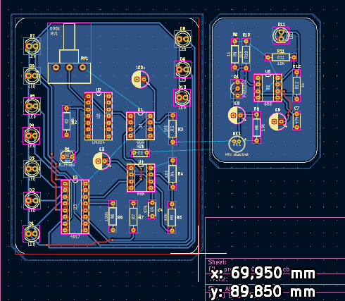

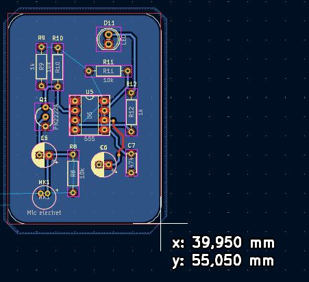

Es una ruleta de luces led que "gira" al tapar el LDR y al destaparlo se detiene en un color de led aleatorio.

Quieren hacerlo en corte láser en terciado y en acrílico opaco, que tenga forma de ruleta.

Tienen 2 PCBs una mide 69.95mm x 89.85mm, la otra es de 39.50mm x 55.05mm

### Medidas de placas PCB del proyecto-06

[sesion-15b de clifford1one](https://github.com/clifford1one/dis8644-2025-1-proyectos/tree/main/07-clifford1one/sesion-15b)

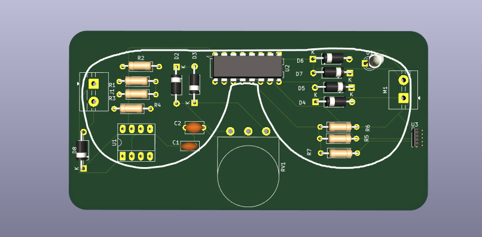

---

## Cotización de materiales de fijación (1 punto)

La cotización de los materiales estimados y supuetos para la realización de este montaje se encuentran en el siguiente link: [Cotización](https://docs.google.com/spreadsheets/d/1CT1RtA_BYuWpyJ54k9VGduSAs_nKiFYd9yf2WvjZ-4g/edit?gid=340656621#gid=340656621)

## Filamentos 3D y materiales de carcasas para cada proyecto

### Proyecto-01

Integrantes:

- Emilia Contreras
- Katalina Riquelme
- Thyare Santander

- Emilia Contreras
- Katalina Riquelme
- Thyare Santander

El grupo declara que su prototipo se hará en impresión 3D, lo quieren hacer por su cuenta.

En este link pueden encontrar diversas opciones de filamentos: [filamentos](https://www.todotoner.cl/impresoras/impresoras-3d/filamentos/tpu-500g-transparente-ppc?source_impresee=ifnkjd4mpxugs6zx83pdhziy3v&IText=filamentos%20esun)

En caso de necesitar unir piezas se recomienda el uso de tornillos M3, la cual será la medida estándar establecida en el taller, estos se pueden encontrar en: [Tornillos](https://www.cimech3d.cl/producto/perno-m3-zincado-pack-50/?srsltid=AfmBOooZL1rCLgmrz2yHb-8EatIMO3Y4J9RszVUNFPxMAbg5tHtpm0yU)

### Proyecto-02

Integrantes:

- Sofía Etchepare
- Antonia Fuentealba
- Sofía Pérez

- Sofía Etchepare
- Antonia Fuentealba
- Sofía Pérez

Material: PLA rojo cereza.

Se recomienda el uso del siguiente filamento, ya que es de la marca esun, tiene un color similar, es de los precios más accesibles y la tienda es confiable.
Pueden encontrarlo en el siguiente link: [Filamento](https://www.todotoner.cl/impresoras/impresoras-3d/filamentos/pla-mate-1kg-morado-claro-esun?gad_source=1&gad_campaignid=17338826608&gbraid=0AAAAADmvC_PVMoT3SZ66TqHzNozo-DSD9&gclid=CjwKCAjw6s7CBhACEiwAuHQckqzDDBkfnkPM2PYtGCCYPcrpPY9Hu1TsMn3gXh0uaMSL_N58xKuCbhoCxbMQAvD_BwE)

Considerando que su proyecto es en base a una forma cilíndrica, con medidas 120 - 150 mm de diámetro x 55mm de alto, se calcula el uso de aproximadamente 57 gramos de filamento PLA. Esto con paredes de 3 mm y relleno de 10% en calidad estándar.

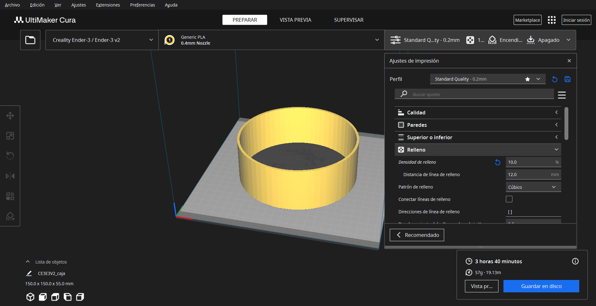

Para unir distintas partes se recomienda el uso de tornillos de M3, la cual será la medida estándar establecida en el taller, estos se pueden encontrar en: [Tornillos](https://www.cimech3d.cl/producto/perno-m3-zincado-pack-50/?srsltid=AfmBOooZL1rCLgmrz2yHb-8EatIMO3Y4J9RszVUNFPxMAbg5tHtpm0yU)

### Proyecto-03

Integrantes:

- Sofía Cartes
- Isabella Gutierrez
- Valentina Ruz
  
El equipo menciona que quiere usar acrílico de colores para generar una esfera de aprox 150-200 mm de diametro.

Se recomienda el uso de acrilico de 3mm, pueden encontrarlo en el siguiente link: [Acrilicos](https://novoacril.cl/acrilico-fluorescente)

En este link pueden encontrar diversos colores y dimensiones.

En cuanto al armado de su prototipo se recomienda cortar en láser, sobre todo cuando buscan armar en base a ensambles.

Para unir las placas al acrilico de manera pulida se recomienda hacer una especie de riel de acrílico curvado  mediante calor en el que se logren ubicar las placas, esto para no romper con la transparencia del objeto.

Esta idea ya se propuso al grupo y está en evaluación.

este sería pegado a las paredes de la estructura mediante cianocrilato, pueden encontrarlo aqui: [Cianocrilato](https://www.mercadolibre.cl/adhesivo-magico-acelerado-seca-9-segundos-100gr-400ml-rex-color-blanco/p/MLC44873226?pdp_filters=item_id%3AMLC1572226595&from=gshop&matt_tool=83114261&matt_word=&matt_source=google&matt_campaign_id=22116391437&matt_ad_group_id=173057321469&matt_match_type=&matt_network=g&matt_device=c&matt_creative=729566854243&matt_keyword=&matt_ad_position=&matt_ad_type=pla&matt_merchant_id=735085901&matt_product_id=MLC44873226-product&matt_product_partition_id=2388258797660&matt_target_id=pla-2388258797660&cq_src=google_ads&cq_cmp=22116391437&cq_net=g&cq_plt=gp&cq_med=pla&gad_source=1&gad_campaignid=22116391437&gbraid=0AAAAADxxu6oPwtiwzjzxrJIeq7W_xnKui&gclid=Cj0KCQjwmK_CBhCEARIsAMKwcD7jPxQUKWGo0D3Lz3jVmOcSdGZrc1dMGtJBlMCvEiQQTUCpvZU_RyMaAkJ0EALw_wcB)

Este adhesivo lo pueden comprar en conjunto al equipo 5 que también usa acrílico u otros equipos que trabajan con impresión 3d.

### Proyecto-04

Integrantes:

- Braulio Figueroa
- Carlo Martínez
- Bastian Solís

Para su trabajo se recomienda el uso de materiales resistentes, ya que los gatos pueden ser algo bruscos para jugar, se recomienda la madera porque es un material accesible.
Se recomienda terciado de 15mm, ya que es liviano y facil de trabajar, lo pueden encontrar aqui: [Terciado15mm](https://www.imperial.cl/terciados/terciado-estructural-15mm-120x240mt/product/74734)

Para pegar la madera pueden usar [colaFria](https://www.idepal.cl/cola-fria-rex-1kg-doy-pack?srsltid=AfmBOoqiDSBRyhwMtFz5JqQEkZQnWm6lq6_Erl9XHxyvtGMBtg4LPeCh)

Podrían hacer detalles en impresión 3D en color verde o azul, considerando que eso son los colores que supuestamente ven los gatos, lo que puede hacer el juguete mucho más llamativo.

Pueden revisar los filamentos disponibles en el Lab en este link: [Cotización](https://docs.google.com/spreadsheets/d/1CT1RtA_BYuWpyJ54k9VGduSAs_nKiFYd9yf2WvjZ-4g/edit?gid=340656621#gid=340656621)

Como propuesta podrían cubrir con alfombra rascadora para amortiguar la dureza de la madera y conseguir una doble función.

### Proyecto-05

Integrantes:

- Antonia Cristi
- Natalia Pilar
- Paulina Vargas

El equipo menciona que quieren prototipar con terciado y acrílico opaco cortando en láser.

Se recomienda usar materiales de 3mm.

Tamaño estimado: menos de 100-150 mm

Pueden encontrarlos aquí: [Acrilicos](https://novoacril.cl/acrilico-color-2)
[Terciado3mm](https://www.imperial.cl/terciados/terciado-eucaliptus-rosado-3mm-162x220mt/product/95091?utm_term=&hsa_grp=&hsa_ad=&hsa_tgt=&hsa_kw=&hsa_mt=&gad_campaignid=17181152287)

Para pegar la madera pueden usar [colaFria](https://www.idepal.cl/cola-fria-rex-1kg-doy-pack?srsltid=AfmBOoqiDSBRyhwMtFz5JqQEkZQnWm6lq6_Erl9XHxyvtGMBtg4LPeCh)

Por el tamaño de su proyecto se recomienda compartir material o gastos con algún otro equipo.

### Proyecto-06

Integrantes:

- Santiago Gaete Fernández
- Anaís Marschhausen Gajardo
- Sebastián Saez Olivares

Estiman hacer 3 cintillos unidos de TPU Y PTG

Este es el color de TPU más accesible:
[FilamentoTPU](https://www.todotoner.cl/impresoras/impresoras-3d/filamentos/tpu-500g-transparente-ppc?source_impresee=ifnkjd4mpxugs6zx83pdhziy3v)

De igual forma dentro de TodoToner se puede encontrar mucha variedad de la misma marca, aunque con distintos valores dependiendo de su color.

En el caso de los filamentos PTG, la mayoría de la marca esun se encuentran en un rango de precio similar, los pueden encontrar aquí:
[FilamentoPTG](https://www.todotoner.cl/impresoras/impresoras-3d/filamentos/tpu-500g-transparente-ppc?source_impresee=ifnkjd4mpxugs6zx83pdhziy3v&IText=ptg)

## Diseño de carcasas UDPUDU (1 punto)

UDPUDU es una pcb que debe verse, no puede estar oculta. Por lo tento decidimos usar acrílico para la parte superior e inferior. La carcasa necesita espacio para cables de speaker, fuente de poder y caimanes.

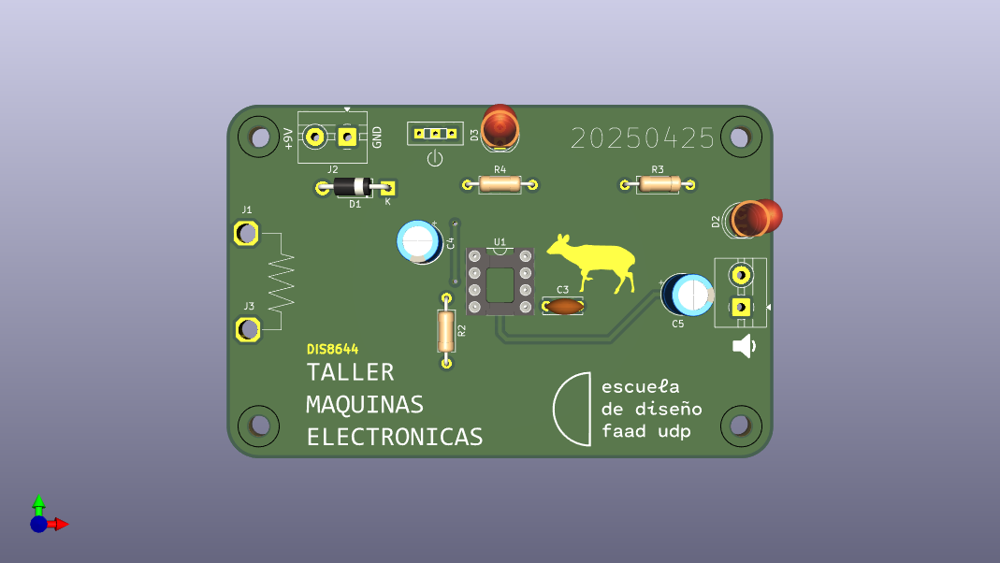

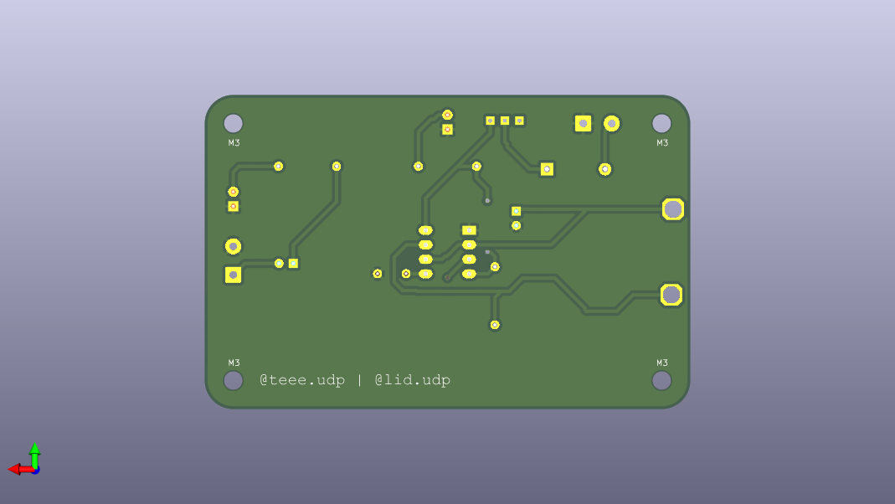

La carcaasa se basa en un borde de PLA con agujeros libres para la salida de cables del speaker y la fuente de poder, además de un espacio para poder poner los caimánes. En la parte superior e inferior tiene un sacado para poner el acrílico cortado en láser.

En la siguiente imagen se ve la idea principal de la carcasa. Aún falta la forma final y el ensamble del acrílico.

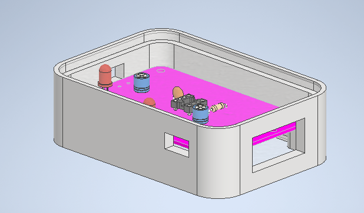

---

### Sería interesante que los grupos implementaran acrílico en ciertas paredes de sus prototipos, que permitan ver los circuitos internos y despierten la curiosidad de los usuarios y espectadores.

## Comunicación y colaboración con equipos:

### Propuestas proyecto-02

Integrantes:
- Sofía Etchepare 
- Antonia Fuentealba 
- Sofía Pérez 

Al hablar con el equipo, nos pidieron ayuda con el tema del diseño de la carcasa porque no tenían muy claro cómo poner el speaker ni la batería. Nosotros pudimos ayudarlas y guiarlas en la estructura de su máquina. Se definió que trabajaremos en conjunto para la realización de modelos 3D y nos pondremos de acuerdo durante la semana en terminos formales. 

Se propuso la creación de una pieza 3d que sirva para mantener el piezo a ras de la cubierta y que éste pueda cambiarse en caso de dañarse.

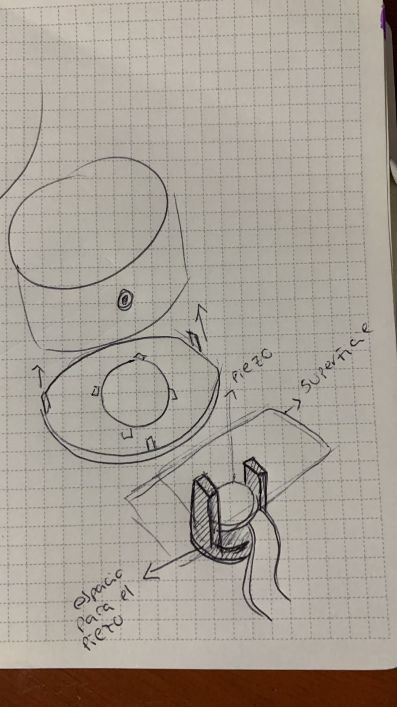

---

### Propuestas proyecto-03

Integrantes:
- Sofía Cartes 
- Isabella Gutierrez 
- Valentina Ruz 

Para unir las placas al acrilico de manera pulida se recomienda hacer una especie de riel de acrílico curvado  mediante calor en el que se logren ubicar las placas, esto para no romper con la transparencia del objeto, como en la siguiente imagen:

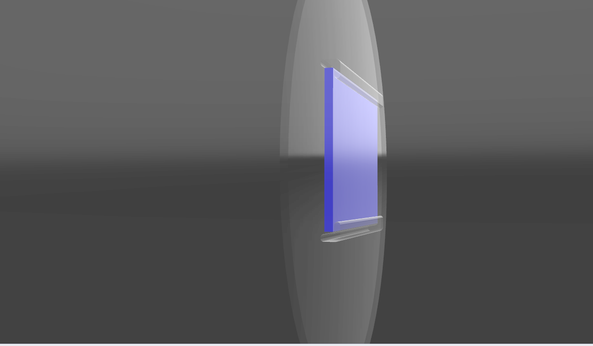

Esta idea ya se propuso al grupo y está en evaluación.

este sería pegado a las paredes de la estructura mediante cianocrilato, pueden encontrarlo aqui: [Cianocrilato](https://www.mercadolibre.cl/adhesivo-magico-acelerado-seca-9-segundos-100gr-400ml-rex-color-blanco/p/MLC44873226?pdp_filters=item_id%3AMLC1572226595&from=gshop&matt_tool=83114261&matt_word=&matt_source=google&matt_campaign_id=22116391437&matt_ad_group_id=173057321469&matt_match_type=&matt_network=g&matt_device=c&matt_creative=729566854243&matt_keyword=&matt_ad_position=&matt_ad_type=pla&matt_merchant_id=735085901&matt_product_id=MLC44873226-product&matt_product_partition_id=2388258797660&matt_target_id=pla-2388258797660&cq_src=google_ads&cq_cmp=22116391437&cq_net=g&cq_plt=gp&cq_med=pla&gad_source=1&gad_campaignid=22116391437&gbraid=0AAAAADxxu6oPwtiwzjzxrJIeq7W_xnKui&gclid=Cj0KCQjwmK_CBhCEARIsAMKwcD7jPxQUKWGo0D3Lz3jVmOcSdGZrc1dMGtJBlMCvEiQQTUCpvZU_RyMaAkJ0EALw_wcB)

Este adhesivo lo pueden comprar en conjunto al equipo 5 que también usa acrílico u otros equipos que trabajan con impresión 3D.

---

### Propuestas proyecto-05

Integrantes:

- Antonia Cristi
- Natalia Pilar
- Paulina Vargas

Al hablar con el equipo, se le propuso hacer que la pcb donde van los leds sea circular, para que parezca una ruleta. Prefirieron dejar una forma rectangular porque aún no estában claras de la forma final.

---

### Propuestas proyecto-06

Integrantes:
- Santiago Gaete Fernández 
- Anaís Marschhausen Gajardo
- Sebastián Saez Olivares

Durante la clase 14b se propone el uso de impresión 3d en TPU, para que el uso de su objeto sea cómodo para el usuario y que la fabricación sea más precisa, ya que consideraban el uso de material textil, con el cual sería difícil lograr la estabilidad o resistencia para contener el circuito y mantenerlo en su lugar.

Se propone como referente las gafas de Cíclope de X-men, porque declararon que no querían que su objeto fuera algo sutil.

---

## Bibliografía

- [sesion-15b de clifford1one](https://github.com/clifford1one/dis8644-2025-1-proyectos/tree/main/07-clifford1one/sesion-15b)

- [GitHub de ayudas y anuncios](https://github.com/orgs/disenoUDP/projects/4/views/1)

- [Filamento transparente](https://www.todotoner.cl/impresoras/impresoras-3d/filamentos/tpu-500g-transparente-ppc?source_impresee=ifnkjd4mpxugs6zx83pdhziy3v&IText=filamentos%20esun)

- [Tornillos](https://www.cimech3d.cl/producto/perno-m3-zincado-pack-50/?srsltid=AfmBOooZL1rCLgmrz2yHb-8EatIMO3Y4J9RszVUNFPxMAbg5tHtpm0yU)

- [Filamento grupo-02](https://www.todotoner.cl/impresoras/impresoras-3d/filamentos/pla-mate-1kg-morado-claro-esun?gad_source=1&gad_campaignid=17338826608&gbraid=0AAAAADmvC_PVMoT3SZ66TqHzNozo-DSD9&gclid=CjwKCAjw6s7CBhACEiwAuHQckqzDDBkfnkPM2PYtGCCYPcrpPY9Hu1TsMn3gXh0uaMSL_N58xKuCbhoCxbMQAvD_BwE)

- [Acrílicos fluorecentes](https://novoacril.cl/acrilico-fluorescente)

- [Cianocrilato](https://www.mercadolibre.cl/adhesivo-magico-acelerado-seca-9-segundos-100gr-400ml-rex-color-blanco/p/MLC44873226?pdp_filters=item_id%3AMLC1572226595&from=gshop&matt_tool=83114261&matt_word=&matt_source=google&matt_campaign_id=22116391437&matt_ad_group_id=173057321469&matt_match_type=&matt_network=g&matt_device=c&matt_creative=729566854243&matt_keyword=&matt_ad_position=&matt_ad_type=pla&matt_merchant_id=735085901&matt_product_id=MLC44873226-product&matt_product_partition_id=2388258797660&matt_target_id=pla-2388258797660&cq_src=google_ads&cq_cmp=22116391437&cq_net=g&cq_plt=gp&cq_med=pla&gad_source=1&gad_campaignid=22116391437&gbraid=0AAAAADxxu6oPwtiwzjzxrJIeq7W_xnKui&gclid=Cj0KCQjwmK_CBhCEARIsAMKwcD7jPxQUKWGo0D3Lz3jVmOcSdGZrc1dMGtJBlMCvEiQQTUCpvZU_RyMaAkJ0EALw_wcB)

- [Terciado 15mm](https://www.imperial.cl/terciados/terciado-estructural-15mm-120x240mt/product/74734)

- [Cola Fria](https://www.idepal.cl/cola-fria-rex-1kg-doy-pack?srsltid=AfmBOoqiDSBRyhwMtFz5JqQEkZQnWm6lq6_Erl9XHxyvtGMBtg4LPeCh)

- [Filamentos en el laboratorio](https://docs.google.com/spreadsheets/d/1CT1RtA_BYuWpyJ54k9VGduSAs_nKiFYd9yf2WvjZ-4g/edit?gid=340656621#gid=340656621)

- [Acrílicos de colores](https://novoacril.cl/acrilico-color-2)

- [Terciado 3mm](https://www.imperial.cl/terciados/terciado-eucaliptus-rosado-3mm-162x220mt/product/95091?utm_term=&hsa_grp=&hsa_ad=&hsa_tgt=&hsa_kw=&hsa_mt=&gad_campaignid=17181152287)

- [Filamento TPU](https://www.todotoner.cl/impresoras/impresoras-3d/filamentos/tpu-500g-transparente-ppc?source_impresee=ifnkjd4mpxugs6zx83pdhziy3v)
