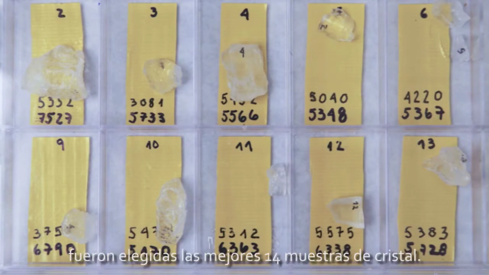
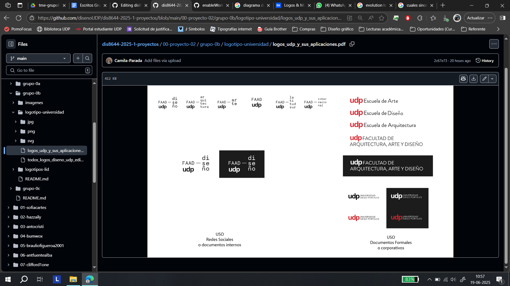
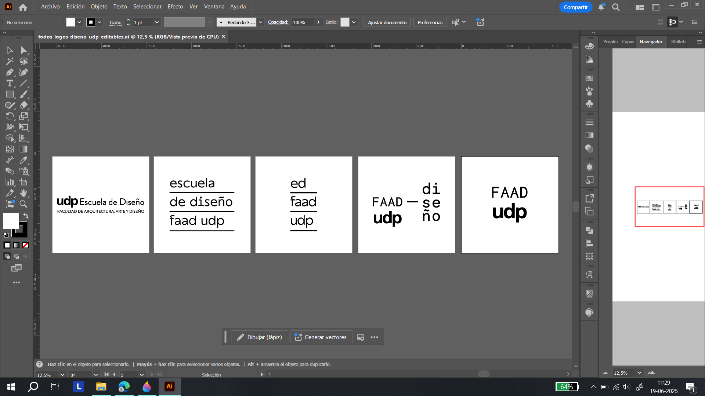
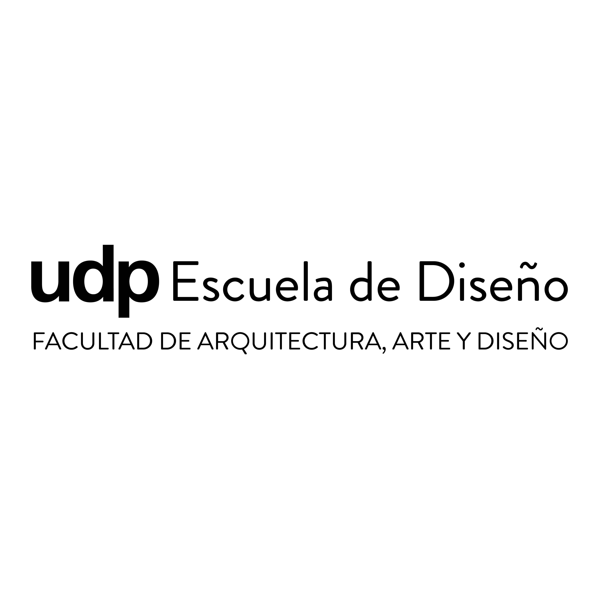
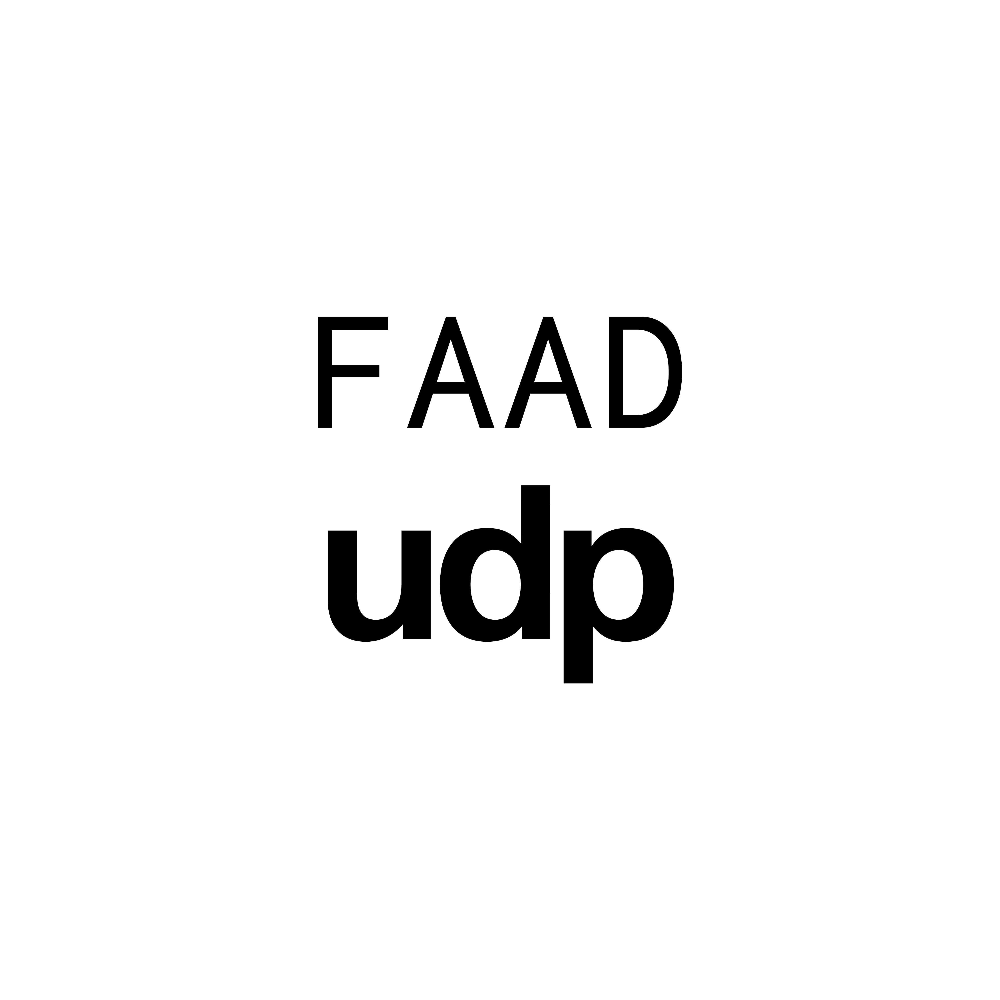
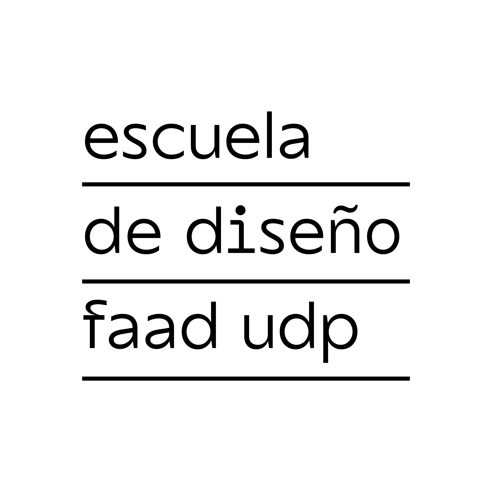

# proyecto-02-grupo-0b

## video, fotografía y gráficas

se evaluarán estos 6 aspectos, con un puntaje de 0.0 a 1.0 puntos cada uno, sumando un total de 6 puntos:

## Acerca del proyecto

Integrantes:

jotaMorales, bernardita y camila

- Bernardita Lobo TODO: agregar enlace a su github.com
- José Morales TODO: agregar enlace a su github.com
- Camila Parada TODO: agregar enlace a su github.com

## Pauta

1. referentes de documentación en video y plan de documentación (jotaMorales)
2. instrucciones de documentación en video para consistencia en los proyectos (jotaMorales)
3. referentes de documentación en imagen y plan de documentación (bernardita)
4. propuesta de montaje de proyectos en sala de clases y en laboratorio (bernardita)
5. publicación en github de de alta calidad de logos institucionales de UDP (camila)
6. creación y adaptación de material gráfico de laboratorio lid.udp y teee.udp (camila)

***

## Referentes de documentación en video y plan de documentación ( 1 punto)

El responsable de esta sección es @jotamorales-romulus.

### Análisis de Domestika

###### ▼ Recuperado de: [Técnicas de Dibujo para Principiantes: trabaja la Observación - Curso de Alvaro Arteaga | Domestika](https://www.youtube.com/watch?v=ECKjj8N1EQ0&ab_channel=Domestika). Sitio web asociado: [Técnicas de dibujo para principiantes: trabaja la observación - Domestika](https://www.domestika.org/es/courses/3123-tecnicas-de-dibujo-para-principiantes-trabaja-la-observacion)

Se utilizan fondos neutros, planos detalle bien enfocados y una ambientación que resalta el trabajo manual y digital del diseñador. Aunque la mayoría no incluye narración hablada constante, la historia del proyecto se cuenta visualmente a través del proceso: bocetos, pruebas, errores, materiales, herramientas y resultados finales. Dejo un referente de la video promocional de las clases del profesor alvarejo.

No se busco sólo mostrar el resultado final, sino también documentar el recorrido completo, destacando las decisiones creativas y técnicas que llevaron al desarrollo del proyecto.

Adjuntar fotos que demuestren lo que describes con palabras

Si dices fondo neutro, ejemplificar, incluso mostrar lo contrario, qué es no neutro, muchas guías de estilo te muestran lo correcto y lo incorrecto.

### Análisis de "The Life of Crystal"

Quiero destacar como referente a Mónica Bate, quien durante la visita a la clase nos mostró el video ["The Life of crystal"](https://youtu.be/QwudnMArIaE?si=cQvweEY_z5HVqYQe), donde documenta su proyecto de arte sonoro con cristales piezoeléctricos. Elijo este video como referente porque se acerca más a lo que vamos a hacer en el taller con los trabajos de examen y siento que tiene mayor sintonía con nuestro enfoque. Además, cuenta con una edición y registro simples pero funcionales, bastante minimalistas, donde muestra claramente los avances y la interacción con el usuario.

###### ▼ Recuperado de: [The Life of Crystals, Nueva York, 2013. Mónica Bate - SÓNEC](https://www.youtube.com/watch?v=QwudnMArIaE&ab_channel=S%C3%93NECSonotecadeM%C3%BAsicaExperimentalyArteSonoro) (captura de imagen).

Fuente <https://lh5.googleusercontent.com/proxy/LxSHesjhJMibf4FLuwPAjM87Rl06DQ_L2NyZSxgrZAlOhwksZvD5FZMQEW5JpKfqAGyMP66MvSUM5uGqbu51_nQqgDYhwOysRIUCv3yV9epNSX65xU2lqgW82g5dmCEQrssyzr2-4I_POwWGFWlYANrXnp8K6Hk>

Fuente <https://lh4.googleusercontent.com/proxy/v1NTxQH57_KuEY9vmlkkjv2_n9VypT23fJWZ-d2lqQyDb3U4_CikbdHZApgyVpo0L9B0i3of7goLc3Lq4N-j3dGf9nZJJlqBRh9xgjaKIzXZpYKW_M5WbTdDTWMSVh-s6sWdC7ZcIclsrqqctA>
Adjuntar fotos que demuestren lo que describes con palabras

### Taller celebración UDP Diseño etc

- Reels de instragram los cuales muestran el avance de las clases durante el semestre [Taller de Celebración UDP — Instagram] (<https://www.instagram.com/tallerdecelebracionudp>)

Adjuntar fotos explicando lo que ves, y qué quieres rescatar y qué no.

***

## Instrucciones de documentación en video para consistencia en los proyectos (1 punto)

El responsable de esta sección es @jotamorales-romulus.

Para la segunda sesión de registro, se empezs a registrar avances y prototipos en protoboard. Formato vertical y horizontal.

### Reels

- Registro de videos de 5 segundos en formato vertical, los cuales capturan el trabajo en las sesiones.

### Videos Horizontal  

### Introducción breve del taller

ESTO ES UNO POR GRUPO? UNO PARA TODO EL GRUPO?
QUIÉN LO HACE?
SI LO HACE JOTA, CÓMO EL GRUPO LE PIDE A JOTA QUE LO HAGA?

### Registro de Proyectos

- Nombre del grupo cuando aparezca su proyecto en pantalla
- Nombre intregantes  
- Breve descripción del proyecto

### Registro del proceso

- Prototipos en protoboard  
- Montaje y pruebas del circuito  
- Interacción con el usuario

### Resultado

- Prototipo funcionando en protoboard
- Prototipo funcionando en PCB
- Prototipo funcionando en caja o carcasa
- Montaje estético, funcional, mecánico y eléctrico
- Uso en contexto

Agregar ejemplos de video o imagen como referencia visual.

OJO CON LA JERARQUÍA DE INFORMACIÓN CON LOS #

### Instrucciones técnicas para la documentación (consistencia entre grupos)

Para mantener coherencia visual y técnica entre todos los registros:

## Formato y resolución

- Formato horizontal o vertical (16:9)
- Resolución mínima: 1080p (Full HD)
- FPS: 30 cuadros por segundo

PREGUNTA: Cómo sé que cumplo con eso?

## Tipos de planos sugeridos

- Plano general del circuito en uso  
- Plano detalle de componentes  
- Plano medio o subjetivo si hay interacción
- Una vista del curso trabajando

Agregar ejemplos visuales.

## Audio

- La idea es registrar el audio si el proyecto produce algun sonido, y dejar sin audio si no tiene.

Ojalá usar alguna canción de fondo sobre cultura electrónica.

## Iluminación

- Usar luz blanca o luz natural.
  
- Sombras creativas si refuerzan el concepto.

## Checklist de grabación por grupo FINAL

- [ ] Registro del circuito en protoboard  
- [ ] Registro del montaje final (2 de julio 2025)  
- [ ] Grabación del circuito en uso o en contexto  
- [ ] Fotografías de calidad del proyecto  
- [ ] Testimonio breve (opcional, pero recomendado o puede ser escrito)  
- [ ] Archivos bien nombrados: `grupoXX-nombre-2024-06-14.mp4`  
- [ ] Entrega vía wetransfer a jotamorales-romulus.

***

## referentes de documentación en imagen y plan de documentación (1 punto)

La responsable de esta sección es @Bernardita-lobo.

### Referentes e investigación para los registros

- Estas fotografías de productos que me gustaron las tomé como referencia. Me pareció simple y neutra la manera en que expone sus productos, pero también muy acotada. <https://www.trucco.photography/productos>

Fuente <https://images.squarespace-cdn.com/content/v1/55814e1de4b0f9f986faf351/1440725269068-ZH3CG5A674FMJMB0ZQ4R/image-asset.jpeg?format=2500w>

Fuente <https://images.squarespace-cdn.com/content/v1/55814e1de4b0f9f986faf351/1437147802659-J0WL73ASBVFSBVZXKKHD/Torna+Final+-+Post.jpg?format=2500w>

- Este otro referente me gustaría considerarlo para la segunda parte del proyecto, ya que en esa etapa nos interesa que los proyectos sean fotografiados en un contexto que se relacione de manera más directa con su funcionamiento y propósito. La idea es que la imagen no solo muestre el objeto, sino también cómo se inserta en su entorno o cómo podría ser utilizado en una situación real. <http://martisans.com/portfolio/>

Fuente <http://martisans.com/wp-content/uploads/2022/06/Marshall-BCN_201_R3-6000x4000.jpg>

fuente <http://martisans.com/wp-content/uploads/2021/10/2021-02-10_stock6271-2500x4000.jpg>

- Además, revisé un video como referencia para comprender mejor qué elementos son necesarios al momento de fotografiar los procesos. <https://youtu.be/75OEz5csiP8?si=EtXw4-0HqXXj7hrX>

## propuesta de montaje de proyectos en sala de clases y en laboratorio (1 punto)

La responsable de esta sección es @Bernardita-lobo.

***

## Publicación en GitHub de de alta calidad de logos institucionales de UDP (1 punto)

Para esta sección se logró obtener un total de cinco logos institucionales relacionados a la escuela de diseño y la facultad d e la universidad.
Estos fueron obtenidos de diferentes fuentes, entre las cuales se encuentran el desarrollo de proyectos en colaboración con organizaciones y desarrollo personal de los vectores de imágenes de cuentas oficiales.

Como consideración, cada versión de estos logotipos se encuentra presente en la carpeta ["logotipo-universidad"](https://github.com/disenoUDP/dis8644-2025-1-proyectos/tree/main/00-proyecto-02/grupo-0b/logotipo-universidad). En esta parte se pueden encontrar una serie de subcarpetas nombradas según su tipo de archivo: jpg, png y svg. A la par se presenta un archivo nombrado [logos_udp_y_sus_aplicaciones.pdf](https://github.com/disenoUDP/dis8644-2025-1-proyectos/blob/main/00-proyecto-02/grupo-0b/logotipo-universidad/logos_udp_y_sus_aplicaciones.pdf) en el que se especifica el uso de cada logotipo desarrollado por parte de la universidad y la facultad (los que se encuentran en uso hasta la fecha), indicando cuales son de uso formal o corporativo, en contraste con los de uso en redes sociales o documentos internos.

###### ▼ Recuperado de: Recurso de manufactura propia (captura de computador).

Otro archivo que se puede notar es un documento con terminación ".ai", un formato vectorial patentado por Adobe y presente en su programa de diseño "Illustrator". Este consiste en un archivo editable el cuál presenta cada uno de los logotipos que se muestran en esta sección, permitiendo editar los vectores y realizar modificaciones a quien cuente con el programa y descargue el archivo.

###### ▼ Recuperado de: Recurso de manufactura propia (captura de imagen).

A continuación se muestra cada versión obtenida en formato jpg, detallando su origen y especificaciones. Cabe especificar que los formatos png y svg son iguales en cuánto a dimensiones y colores, pero para 

### Logotipo de la Facultad de Arte, Arquitectura y Diseño

###### ▼ Recuperado de: Entrega de logotipos en formato "ai" a cargo del "Taller de diseño gráfico II" en 2022 para el desarrollo gráfico de ["Interpretación audiovisual del concierto Sinfonía del Nuevo Mundo de Antonín Dvořák"](https://www.instagram.com/p/Cf4ZUu9OBQ8/?img_index=1). Trabajo en colaboración con el Teatro municipal de Santiago.

Logotipo oficial de la facultad. Este logotipo es usado en publicaciones de caracter corporativo y formal. Posee en el su estructura logotipo acotado de la universidad (udp), las palabras "Escuela de diseño" en grande junto "Facultad de arte, arquitectura y diseño" en mayúsculas, las cuales poseen un menor peso visual. No es posible modificar la composición de los elementos dada su importancia dentro de la institución. Existen logotipos similares para cada carrera de la facultad, además de otras escuelas. Es dificil de trabajarlo a escala pequeña. Fue obtenido junto a 2 versiones del logotipo de la escuela de diseño del 2022.

### Logotipo de la cuenta de instagram de la Escuela de diseño 2025

###### ▼ Recuperado de: Recurso de manufactura propia. Desarrollo vectorial usando illustrator.

Logotipo experimental de la escuela. Su existencia ha sido reciente. Posee en su estructura el logotipo de la "FAAD" (presente abajo), un guión y la palabra "diseño" en minúsculas. Su uso suele verse en publicaciones para redes sociales, afiches entre otras gráficas. Existen logotipos similares para cada carrera. No es posible modificar la composición u partes, puesto que se pierde la identidad que compone el logotipo de la facultad y "diseño". Las versiones de los archivos fueron realizadas por mano propia, descargando la imagen de perfil de la cuenta de instagram de ["diseño_udp"](https://www.instagram.com/diseno_udp/) y trazando los vectores a mano en "Illustrator".

### Logotipo de la cuenta de instagram de la FAAD 2025

###### ▼ Recuperado de: Recurso de manufactura propia. Desarrollo vectorial usando illustrator.

Logotipo experimental de la facultad. Su existencia ha sido reciente. Posee en el su estructura el logotipo acotado de la universidad (las siglas udp), y la palabra FAAD en mayúsculas. Su uso suele verse en publicaciones para redes sociales, afiches entre otras gráficas. Es posible modificar la composición de las partes partes, pero no funciona el uno sin el otro dado que se pierde la identidad. Las versiones de los archivos fueron realizadas por mano propia, descargando la imagen de perfil de la cuenta de instagram de ["faad_udp"](https://www.instagram.com/faad_udp/) y trazando los vectores a mano en "Illustrator".

### Logotipo previo de la Escuela de diseño

###### ▼ Recuperado de: Entrega de logotipos en formato "ai" a cargo del "Taller de diseño gráfico II" en 2022 para el desarrollo gráfico de ["Interpretación audiovisual del concierto Sinfonía del Nuevo Mundo de Antonín Dvořák"](https://www.instagram.com/p/Cf4ZUu9OBQ8/?img_index=1). Trabajo en colaboración con el Teatro municipal de Santiago.

Versión anterior del logotipo de la escuela de diseño. Fue usado hasta 2024. Fue obtenido junto a 2 versiones del logotipo de la escuela de diseño del 2022.

### Logotipo previo de la Escuela de diseño versión acotada

###### ▼ Recuperado de: Entrega de logotipos en formato "ai" a cargo del "Taller de diseño gráfico II" en 2022 para el desarrollo gráfico de ["Interpretación audiovisual del concierto Sinfonía del Nuevo Mundo de Antonín Dvořák"](https://www.instagram.com/p/Cf4ZUu9OBQ8/?img_index=1). Trabajo en colaboración con el Teatro municipal de Santiago.

Cabe mencionar que, en paralelo al desarrollo de este proyecto de curso, se está desarrollando una nueva identidad para la facultad por parte de la académica del estudio ["Gaggero Works"](https://www.gaggeroworks.co.uk/), Constanza Gaggero. Por limitaciones de tiempo, para esta versión no se logró obtener el logotipo expuesto el pasado 13 de junio, ni mucho menos el manual de marca.

###### ▼ Recuperado de: [Discord del curso, canal "dis8644-taller"](https://media.discordapp.net/attachments/1318882679659171892/1382021652623134963/image.png?ex=685580f6&is=68542f76&hm=c322744209bbcb7178bff5600806b7fc19fa43e29d604add118e55843890c714&=&format=webp&quality=lossless&width=518&height=805). Enviado por "misaa.cc" — 10/6/25, 11:40.

***

## creación y adaptación de material gráfico de laboratorio lid.udp y teee.udp (1 punto)

La responsable de esta sección es @Camila-Parada

## Bibliografía
