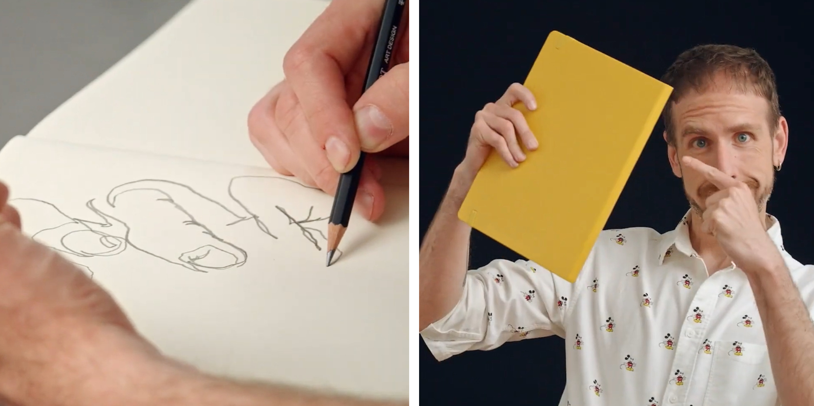
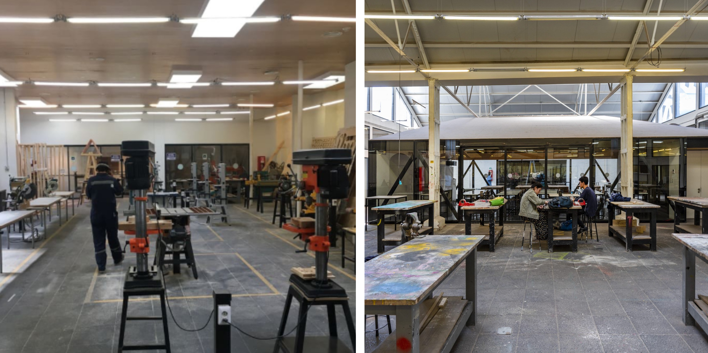
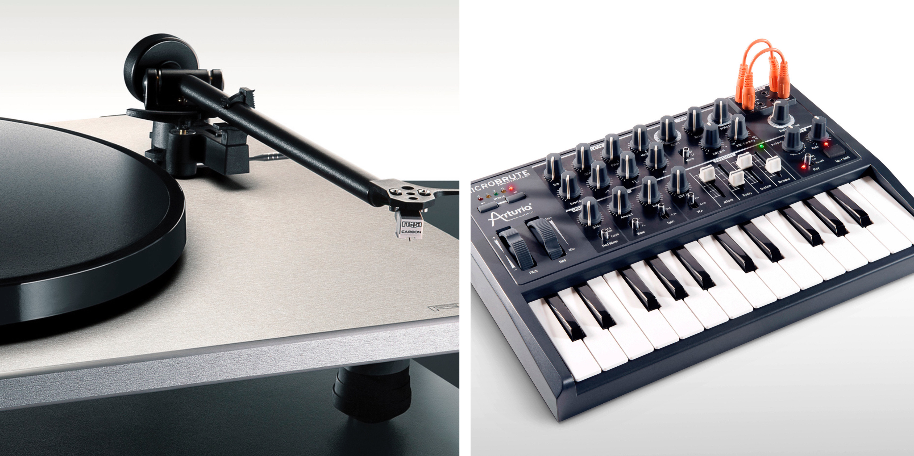
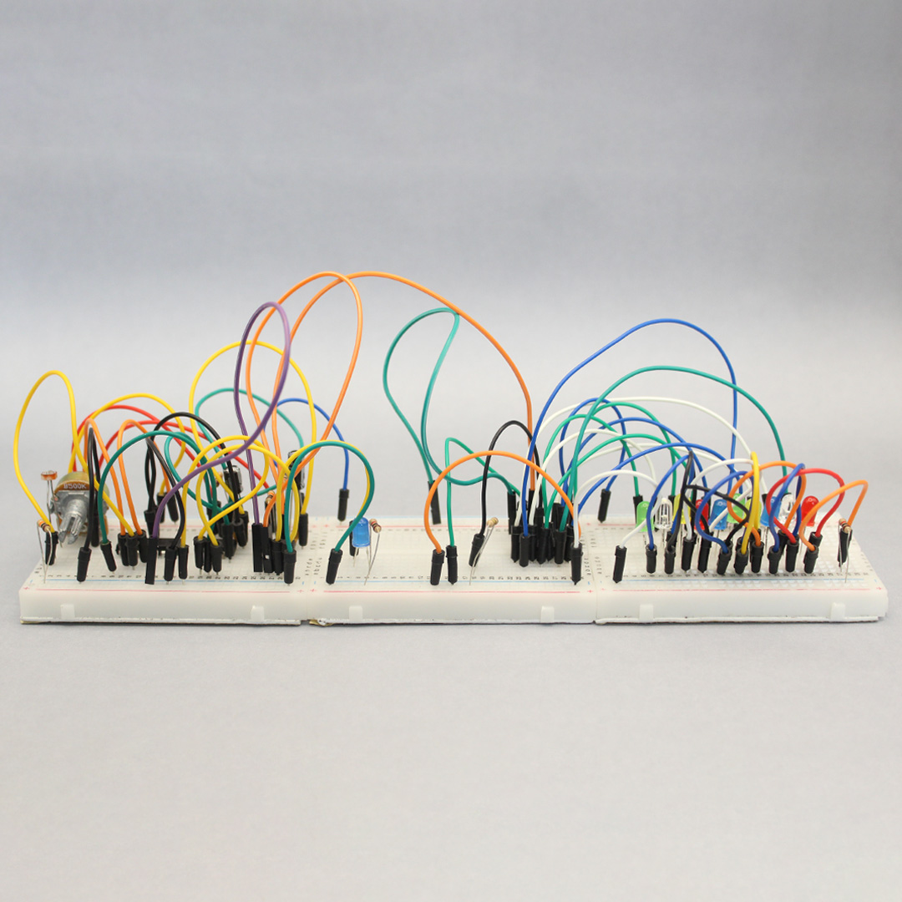
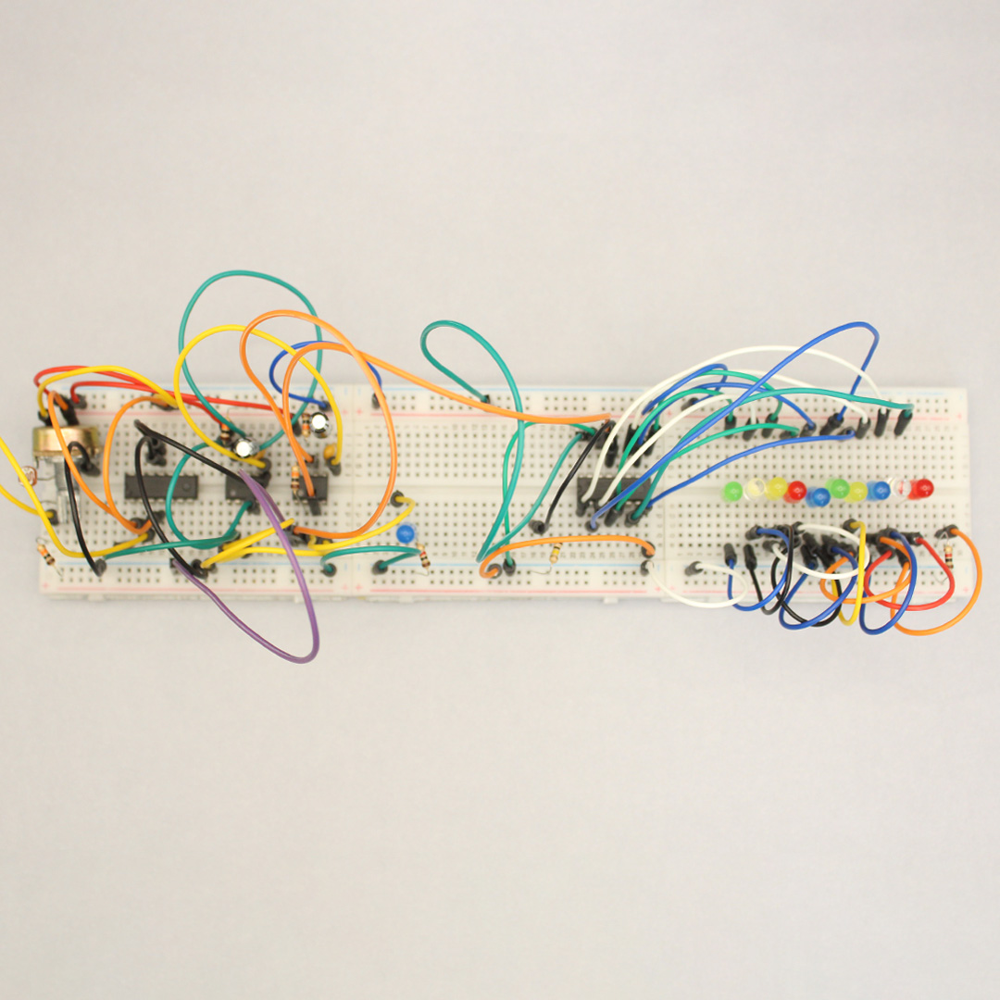
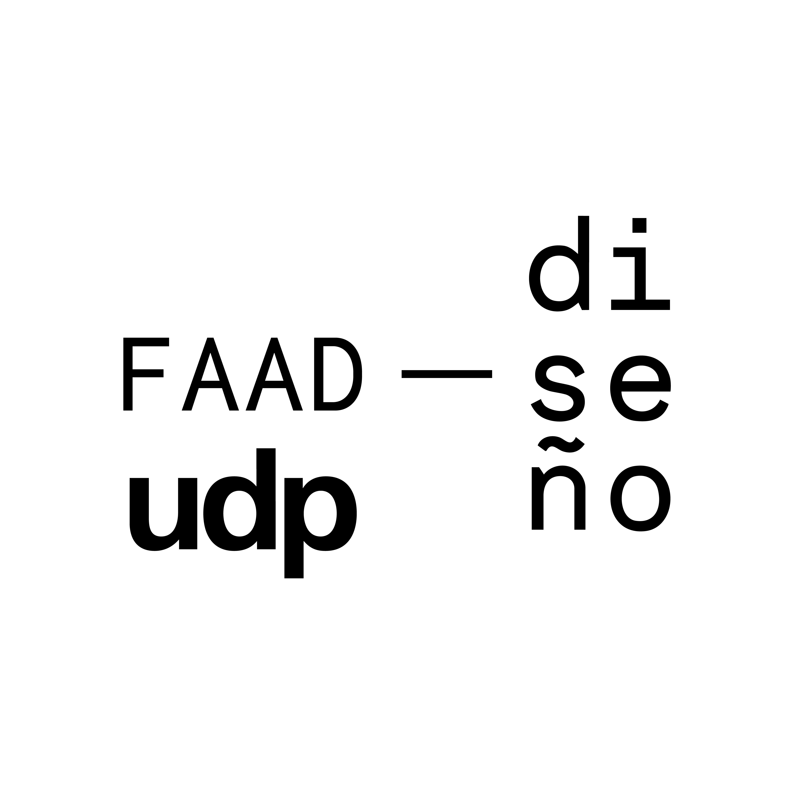
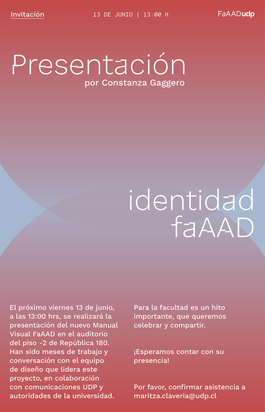
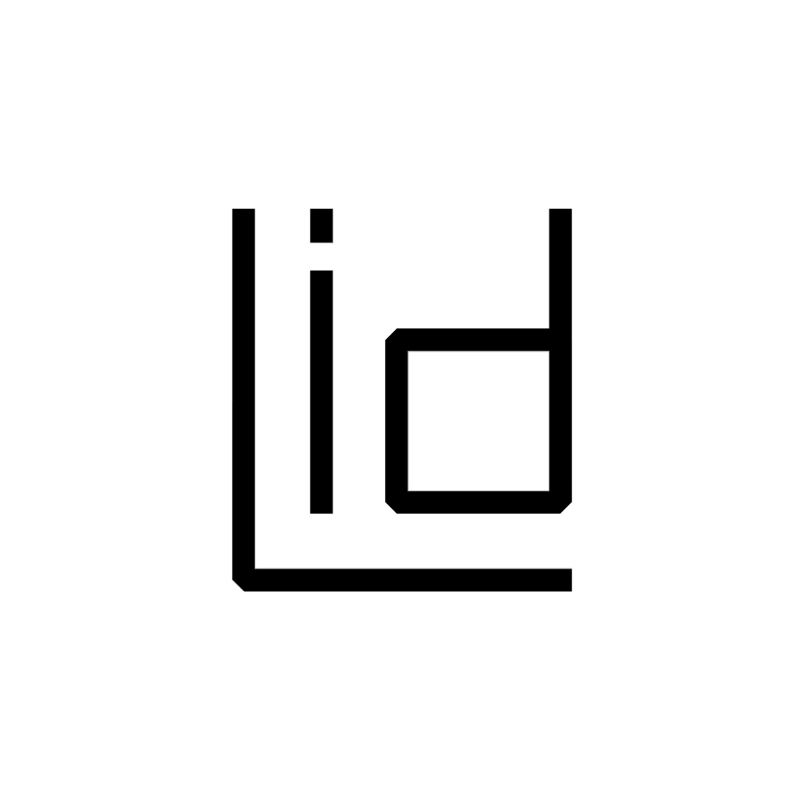
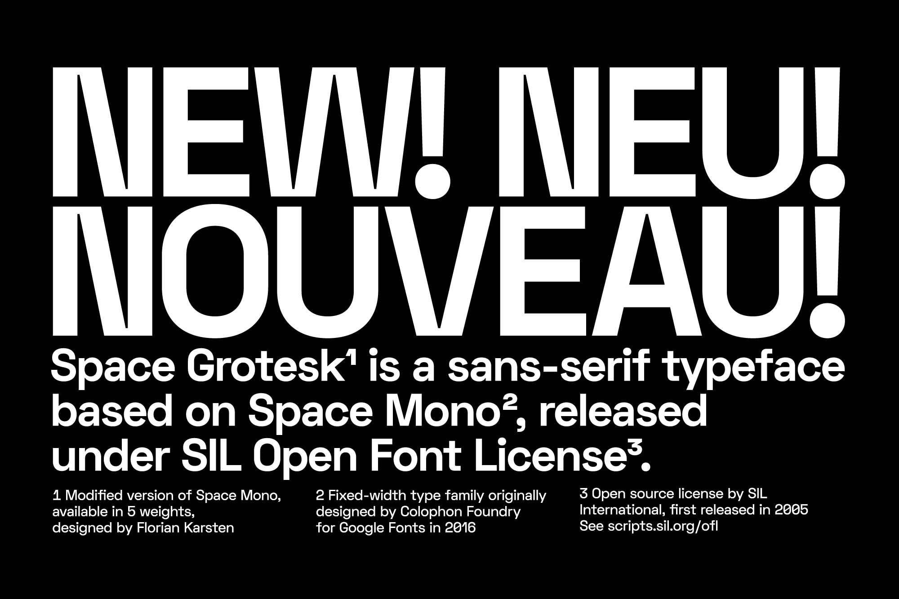

# proyecto-02-grupo-0b

## video, fotografía y gráficas

se evaluarán estos 6 aspectos, con un puntaje de 0.0 a 1.0 puntos cada uno, sumando un total de 6 puntos:

### Acerca del proyecto

Integrantes:

jotaMorales, bernardita y camila

- [Bernardita Lobo](https://github.com/Bernardita-lobo).
- [José Morales](https://github.com/jotamorales-romulus).
- [Camila Parada](https://github.com/Camila-Parada).

### Pauta

1. referentes de documentación en video y plan de documentación (jotaMorales)
2. instrucciones de documentación en video para consistencia en los proyectos (jotaMorales)
3. referentes de documentación en imagen y plan de documentación (bernardita)
4. propuesta de montaje de proyectos en sala de clases y en laboratorio (bernardita)
5. publicación en github de de alta calidad de logos institucionales de UDP (camila)
6. creación y adaptación de material gráfico de laboratorio lid.udp y teee.udp (camila)

***

## Referentes de documentación en video y plan de documentación ( 1 punto)

El responsable de esta sección es @jotamorales-romulus.

### Análisis de Domestika

▼ Fuente: [Técnicas de Dibujo para Principiantes: trabaja la Observación - Curso de Alvaro Arteaga | Domestika](https://www.youtube.com/watch?v=ECKjj8N1EQ0&ab_channel=Domestika). Sitio web asociado: [Técnicas de dibujo para principiantes: trabaja la observación - Domestika](https://www.domestika.org/es/courses/3123-tecnicas-de-dibujo-para-principiantes-trabaja-la-observacion)

Se utilizan fondos neutros, planos detalle bien enfocados y una ambientación que resalta el trabajo manual y digital del diseñador. Aunque la mayoría no incluye narración hablada constante, la historia del proyecto se cuenta visualmente a través del proceso: bocetos, pruebas, errores, materiales, herramientas y resultados finales. Dejo un referente de la video promocional de las clases del profesor alvarejo.

No sólo busco mostrar el resultado final, sino también documentar el recorrido completo, destacando las decisiones creativas y técnicas que llevaron al desarrollo del proyecto.

Ya cuando tengamos en nuestro poder las placas y prototipos para el registro, recomiendo el uso de un fondo neutro (como blanco, gris o negro), ya que no distrae y permite que la audiencia se concentre en lo que realmente importa.

▼ Fuentes: <https://arte.udp.cl/laboratorios/laboratorio-de-maquinas-y-herramientas/>

Usar un fondo no neutro, sería más para el trabajo en clases, cuando se está prototipando u organizando con los grupos. Doy de ejemplo el pañol de la universidad que, con herramientas y materiales, aporta contexto real y autenticidad al registro.
Para el registro en sala, el fondo no neutro puede aportar contexto visual importante que enriquece la comprensión del entorno y la actividad que se está documentando. A diferencia de un fondo neutro, que es más sencillo y minimalista, un fondo con elementos del espacio real, ayuda a mostrar la atmósfera, la dinámica y el ambiente natural donde se desarrolla la clase.

### The Life of Crystal

También quiero destacar como referente a Mónica Bate, quien durante la visita a la clase, nos mostró el video [The Life of Crystals](https://vimeo.com/79735959), donde documenta su proyecto de arte sonoro con cristales piezoeléctricos. Elijo este video como referente porque se acerca más a lo que vamos a hacer en el taller con los trabajos de examen y siento que tiene mayor sintonía con nuestro enfoque. Además, cuenta con una edición y registro simples pero funcionales, bastante minimalistas, donde muestra claramente los avances y la interacción con el usuario.

▼ Fuentes: <https://i0.wp.com/etab.cl/monica-bate/wp-content/uploads/2017/12/DSC0009.jpg?resize=1024%2C680> y <https://i0.wp.com/etab.cl/monica-bate/wp-content/uploads/2017/12/MG_3695.jpg?resize=1024%2C683>

### Reels Instagram Taller: Celebración UDP por Carolina Kusanovich y Felipe Cardemil

Reels de Instagram que muestran el avance de las clases durante el semestre. Estos son grabados por alumnos encargados de registrar el trabajo realizado en clases. Durante las sesiones, se busca registrar la mayor cantidad de contenido posible para luego editar y juntar en un video, que posteriormente se sube a redes sociales.

Estos videos son fáciles de grabar y editar. Normalmente se pueden subir cada semana. Se utiliza música de fondo para hacerlos más atractivos para el espectador. Suelen durar entre 30 segundos y 1 minuto.

[Taller de Celebración UDP — Instagram](https://www.instagram.com/tallerdecelebracionudp?igsh=dXU0aWNhNmR1dHNq)

### Experimental

Para definir la identidad visual del video, tomé como punto de partida el moodboard desarrollado por Camila Parada para la parte de diseño gráfico del examen. Me interesó especialmente su enfoque visual: una mezcla de distorsión, collage, tipografía experimental y caos contenido. Quiero trasladar esa estética al lenguaje audiovisual, explorando recursos como deformaciones visuales, glitches, efectos analógicos y texturas digitales, pero siempre dentro de lo posible y accesible.

Mi intención no es saturar el video, sino intervenirlo de forma sutil, pero significativa. Me interesa registrar a mis compañeros, sus gestos, movimientos o rastros, y trabajar ese material en edición, dándole un tratamiento visual que lo transforme sin desfigurarlo, manteniendo la esencia de la acción original. En ese proceso, también quiero experimentar con la tipografía como un recurso gráfico más; no tanto para comunicar información, sino para aportar ritmo, textura y estilo. Esto se trabajará en conjunto con Camila Parada.

No busco simplemente documentar, sino reinterpretar visualmente lo que ocurre, creando una pieza viva que dialogue con lo que hemos construido colectivamente.

Como referente visual, tomé el video [“Waiting For The End – Recording Vocals | LPTV #42” de Linkin Park](https://www.youtube.com/watch?v=vlcMQ3teZ1g) donde se combinan registros documentales con una edición muy cuidada. Me interesó particularmente cómo se integran efectos visuales como glitches, distorsiones suaves, overlays y tipografía que aparece de forma puntual. Este tratamiento aporta identidad visual al material sin restarle fuerza al contenido. Es ese equilibrio el que busco lograr: una intervención visual que complemente el registro, lo estilice y lo potencie sin opacarlo.

## Instrucciones de documentación en video para consistencia en los proyectos (1 punto)

El responsable de esta sección es @jotamorales-romulus.

Para cada sesión, se realizará un registro audiovisual mediante el uso de una cámara. Además, para el examen, se desarrollarán tres tipos distintos de video como parte del proyecto.

### Almacenamiento

- Los videos serán almacenados en el computador de @jotamorales-romulus. Al finalizar cada clase, los videos se pasarán a través de un adaptador de tarjeda sd

### Reels

- Videos de entre 30 segundos y 1 minuto, en formato vertical (9:16), pensados para redes sociales como Instagram.
- Su objetivo es documentar el proceso del taller de forma fragmentada pero constante, mostrando el ambiente de trabajo y los avances de los distintos grupos.
- La idea es registrar la mayor cantidad de momentos posibles durante las sesiones, para luego contar con suficiente material con el que se puedan editar estos videos.
- Tendrá los logotipos del Laboratorio de Interacción Digital de la UDP y del Taller de Máquinas Electrónicas al inicio. Durante el resto del video, tendrá marca de agua del logotipo del taller.
  
### Video Examen

- Se hará uso de tripode para este registro.
- Se realizará un video que junte todo lo realizado para el examen: Registro de las clase y registro de los proyectos de los grupos.
- Cada video de los grupos, registrará el proyecto completo y funcionará como una cápsula audiovisual que resuma su propuesta, mostrando desde el concepto hasta el resultado final.

### Intro del video

- Nombre taller, Profesores y ayudante
- Logos lab y taller
- Breve introducción del taller

### Proyectos

- Primero, se mostrará parte del registro del taller
El video de cada grupo debe incluir:

- Nombre del grupo cuando aparezca su proyecto en pantalla  
- Nombre de los integrantes  
- Breve descripción del proyecto  
- Imágenes del proceso y resultado final
  
¿Cómo se hará?

- La grabación y edición estarán a cargo de Jota Morales. Cada grupo debe ayudar al registro de su proyecto. La fecha debe ser coordinada por los profesores.
- Tentativamente, se realizará en un espacio del Laboratorio de Interacción Digital o en la sala de fotografía de la FAAD.
  
### Registro del proceso

- Prototipos en protoboard  
- Montaje y pruebas del circuito  
- Interacción con el usuario

### Resultado

- Prototipo funcionando en protoboard
- Prototipo funcionando en PCB
- Prototipo funcionando en caja o carcasa
- Montaje estético, funcional, mecánico y eléctrico
- Uso en contexto

### Formato y resolución de los videos

- Formato horizontal o vertical
- Resolución mínima: 1080p (Full HD)
- FPS: 30 cuadros por segundo
- Al exportar los videos, se verificará que los formatos estén correctos.
- Videos pesados se compartiran por wetransfer a aaron.montoya@mail.udp.cl

### Audio

- La idea es registrar el audio si el proyecto produce algún sonido, y dejar sin audio si no lo produce.
- Se utilizarán canciones de fondo sobre cultura electrónica.

### Puesta en escena

- Usar luz blanca o luz natural.
- Sombras creativas si refuerzan el concepto.
- Fondos neutros y no neutros.

### Checklist de grabación por grupo FINAL

- [ ] Registro del circuito en protoboard  
- [ ] Registro del montaje final (2 de julio 2025)  
- [ ] Grabación del circuito en uso o en contexto  
- [ ] Fotografías de calidad del proyecto  
- [ ] Testimonio breve (opcional, pero recomendado o puede ser escrito)  
- [ ] Archivos bien nombrados: `grupoXX-nombre-2024-06-14.mp4`  
- [ ] Entrega vía wetransfer a jotamorales-romulus.

### Creditos 
- Nombre taller
- Profesores y ayudantes 
- Integrantes del curso divididos por grupo (nombre y apellido)
- Año
  

***

## referentes de documentación en imagen y plan de documentación (1 punto)

La responsable de esta sección es @Bernardita-lobo.

### Referentes e investigación para los registros

- Estas fotografías de productos que me gustaron las tomé como referencia. Me pareció simple y neutra la manera en que expone sus productos, pero también muy acotada. <https://www.trucco.photography/productos>

▼ Fuentes: <https://images.squarespace-cdn.com/content/v1/55814e1de4b0f9f986faf351/1440725269068-ZH3CG5A674FMJMB0ZQ4R/image-asset.jpeg?format=2500w> y <https://images.squarespace-cdn.com/content/v1/55814e1de4b0f9f986faf351/1437147802659-J0WL73ASBVFSBVZXKKHD/Torna+Final+-+Post.jpg?format=2500w>

- Este otro referente me gustaría considerarlo para la segunda parte del proyecto, ya que en esa etapa nos interesa que los proyectos sean fotografiados en un contexto que se relacione de manera más directa con su funcionamiento y propósito. La idea es que la imagen no solo muestre el objeto, sino también cómo se inserta en su entorno o cómo podría ser utilizado en una situación real. <http://martisans.com/portfolio/>

▼ Fuentes: <http://martisans.com/wp-content/uploads/2022/06/Marshall-BCN_201_R3-6000x4000.jpg> y  <http://martisans.com/wp-content/uploads/2021/10/2021-02-10_stock6271-2500x4000.jpg>

- Además, revisé un video como referencia para comprender mejor qué elementos son necesarios al momento de fotografiar los procesos. <https://youtu.be/75OEz5csiP8?si=EtXw4-0HqXXj7hrX>

### Plan de documentación

- Se documentarán las protoboard, las placas PCB, las carcasas, el producto final y en general, cualquier avance que los grupos de trabajo consideren pertinente registrar.
- Para poder tomar registros fotográficos del proceso, primero hacemos el montaje del set. Estas fotos las tomamos en una caja de luz con fondo infinito, que cuenta con iluminación integrada. También colocamos un trípode y una cámara Canon que pedimos prestada del pañol digital.
- Los registros fotográficos se realizan durante el horario de taller. Comenzamos a tomar las fotos a partir de las 10 de la mañana. Además, vamos a agendar sesiones fotográficas en horarios fuera del taller, con el fin de alcanzar a documentar todos los procesos grupales  
- Las fotografías se editan en caso de que queden muy oscuras o si es necesario, eliminar alguna parte del fondo para mejorar su presentación. También se ajusta su tamaño a 1080x1080 píxeles, formato que elegimos para generar contenido para el Instagram del taller, en conjunto con mi compañera Camila Parada.
- Estas fotos son subidas a este [Drive](<https://drive.google.com/drive/folders/1OwoyJ_nTuie-A1s_U5647DsOHI4zlNnj?usp=drive_link>), donde están disponibles en formato JPEG y también como archivos editables de Photoshop. Además, las fotografías se encuentran organizadas en la carpeta "imagenes" presente en las carpetas de los grupos dentro del repositorio "00-proyecto-02", así como en la carpeta "["imagenes"](https://github.com/Camila-Parada/dis8644-2025-1-proyectos/tree/main/00-proyecto-02/grupo-0b/imagenes)" del "grupo-0b", al que pertenece esta misma documentación.
- Los archivos de las fotos fueron nombrados siguiendo el formato: tme-proyecto02-grupo01-registro01, donde se indican las siglas del taller (TME: Taller Máquinas Electrónicas), el número del proyecto, el número del grupo y el número de registro correspondiente.

### Criterios especificos

- Para las fotos de registro del proceso de maqueteo en la protoboard, decidimos utilizar un fondo gris, ya que buscamos lograr una apariencia neutral. En cambio, para las fotografías del proyecto final, que incluyen las PCBs y las carcasas, utilizaremos fondos de colores diferentes para cada uno de los seis grupos, con el objetivo de dar mayor identidad a cada proyecto. Además, como se mencionó en los referentes, también tomaremos las fotos en un contexto que apoye y responda a la función e interacción de cada proyecto.
- Para las fotografías de las protoboard tomamos tres tipos de tomas: una desde la parte frontal con perspectiva, otra en vista superior para que se aprecien con claridad los circuitos, y una tercera que enfoca algún detalle distintivo que sea necesario destacar.

### Registro fotográfico

- Como ejemplo de lo que se trabajó, incluiré tres fotografías correspondientes al grupo 05.

## Propuesta de montaje de proyectos en sala de clases y en laboratorio (1 punto)

La responsable de esta sección es @Bernardita-lobo.

### Elementos clave a mostrar en el montaje

- Para el montaje es fundamental lograr explicar, de manera concisa y accesible, cómo se llegó a los resultados finales. Este taller, en especial, trabaja en una disciplina algo diferente y puede resultar difícil de comprender. En ese sentido, la propuesta del montaje se dividirá en dos secciones: una donde se expongan los proyectos finales y otra donde se evidencien todos los procesos por los que tuvieron que pasar los grupos de trabajo.

***

## Publicación en GitHub de de alta calidad de logos institucionales de UDP (1 punto)

Para esta sección se logró obtener un total de cinco logos institucionales relacionados a la escuela de diseño y la facultad d e la universidad.
Estos fueron obtenidos de diferentes fuentes, entre las cuales se encuentran el desarrollo de proyectos en colaboración con organizaciones y desarrollo personal de los vectores de imágenes de cuentas oficiales.

Como consideración, cada versión de estos logotipos se encuentra presente en la carpeta ["logotipo-universidad"](https://github.com/disenoUDP/dis8644-2025-1-proyectos/tree/main/00-proyecto-02/grupo-0b/logotipo-universidad). En esta parte se pueden encontrar una serie de subcarpetas nombradas según su tipo de archivo: jpg, png y svg. A la par se presenta un archivo nombrado [logos_udp_y_sus_aplicaciones.pdf](https://github.com/disenoUDP/dis8644-2025-1-proyectos/blob/main/00-proyecto-02/grupo-0b/logotipo-universidad/logos_udp_y_sus_aplicaciones.pdf) en el que se especifica el uso de cada logotipo desarrollado por parte de la universidad y la facultad (los que se encuentran en uso hasta la fecha), indicando cuales son de uso formal o corporativo, en contraste con los de uso en redes sociales o documentos internos.

▼ Fuente: Recurso de manufactura propia (captura de computador)

Otro archivo que se puede notar es un documento con terminación ".ai", un formato vectorial patentado por Adobe y presente en su programa de diseño "Illustrator". Este consiste en un archivo editable el cuál presenta cada uno de los logotipos que se muestran en esta sección, permitiendo editar los vectores y realizar modificaciones a quien cuente con el programa y descargue el archivo.

▼ Fuente: Recurso de manufactura propia (captura de imagen)

A continuación se muestra cada versión obtenida en formato jpg, detallando su origen y especificaciones. Cabe especificar que los formatos png y svg son iguales en cuánto a dimensiones y colores, pero para

### Logotipo de la Facultad de Arte, Arquitectura y Diseño

▼ Fuente: Entrega de logotipos en formato "ai" a cargo del "Taller de diseño gráfico II" en 2022 para el desarrollo gráfico de ["Interpretación audiovisual del concierto Sinfonía del Nuevo Mundo de Antonín Dvořák"](https://www.instagram.com/p/Cf4ZUu9OBQ8/?img_index=1). Trabajo en colaboración con el Teatro municipal de Santiago

Logotipo oficial de la facultad. Este logotipo es usado en publicaciones de caracter corporativo y formal. Posee en el su estructura logotipo acotado de la universidad (udp), las palabras "Escuela de diseño" en grande junto "Facultad de arte, arquitectura y diseño" en mayúsculas, las cuales poseen un menor peso visual. No es posible modificar la composición de los elementos dada su importancia dentro de la institución. Existen logotipos similares para cada carrera de la facultad, además de otras escuelas. Es dificil de trabajarlo a escala pequeña. Fue obtenido junto a 2 versiones del logotipo de la escuela de diseño del 2022.

### Logotipo de la cuenta de instagram de la Escuela de diseño 2025

▼ Fuente: Recurso de manufactura propia. Desarrollo vectorial usando Illustrator

Logotipo experimental de la escuela. Su existencia ha sido reciente. Posee en su estructura el logotipo de la "FAAD" (presente abajo), un guión y la palabra "diseño" en minúsculas. Su uso suele verse en publicaciones para redes sociales, afiches entre otras gráficas. Existen logotipos similares para cada carrera. No es posible modificar la composición u partes, puesto que se pierde la identidad que compone el logotipo de la facultad y "diseño". Las versiones de los archivos fueron realizadas por mano propia, descargando la imagen de perfil de la cuenta de instagram de ["diseño_udp"](https://www.instagram.com/diseno_udp/) y trazando los vectores a mano en "Illustrator".

### Logotipo de la cuenta de instagram de la FAAD 2025

▼ Fuente: Recurso de manufactura propia. Desarrollo vectorial usando Illustrator

Logotipo experimental de la facultad. Su existencia ha sido reciente. Posee en el su estructura el logotipo acotado de la universidad (las siglas udp), y la palabra FAAD en mayúsculas. Su uso suele verse en publicaciones para redes sociales, afiches entre otras gráficas. Es posible modificar la composición de las partes partes, pero no funciona el uno sin el otro dado que se pierde la identidad. Las versiones de los archivos fueron realizadas por mano propia, descargando la imagen de perfil de la cuenta de instagram de ["faad_udp"](https://www.instagram.com/faad_udp/) y trazando los vectores a mano en "Illustrator".

### Logotipo previo de la Escuela de diseño

▼ Fuente: Entrega de logotipos en formato "ai" a cargo del "Taller de diseño gráfico II" en 2022 para el desarrollo gráfico de ["Interpretación audiovisual del concierto Sinfonía del Nuevo Mundo de Antonín Dvořák"](https://www.instagram.com/p/Cf4ZUu9OBQ8/?img_index=1). Trabajo en colaboración con el Teatro municipal de Santiago

Versión anterior del logotipo de la escuela de diseño. Fue usado hasta 2024. En este caso es una forma compuesta por texto y líneas, las cuales pueden funcionar sin estas últimas. No se recomienda modificar el orden de las palabras o la estructura por temas de equilibrio visual. Fue obtenido como una de las 2 versiones del logotipo de la escuela de diseño que se usaba en 2022.

### Logotipo previo de la Escuela de diseño versión acotada

▼ Fuente: Entrega de logotipos en formato "ai" a cargo del "Taller de diseño gráfico II" en 2022 para el desarrollo gráfico de ["Interpretación audiovisual del concierto Sinfonía del Nuevo Mundo de Antonín Dvořák"](https://www.instagram.com/p/Cf4ZUu9OBQ8/?img_index=1). Trabajo en colaboración con el Teatro municipal de Santiago

Versión acotada del logotipo de la escuela de diseño. Tiene una menor presencia que el logo anterior mostrado, por lo que sus usos suelen ser para casos específicos en donde se vea comprometido el tamaño de la versión completa. En este caso es una forma compuesta por siglas (ed, faad, udp) y líneas. Si no se sabe lo que representan las letras se puede llevar a la confusión, por lo que no se recomienda modificar el orden o la estructura. Fue obtenido como una de las 2 versiones del logotipo de la escuela de diseño que se usaba en 2022.

. . .

Cabe mencionar que, en paralelo al desarrollo de este proyecto de curso, se está desarrollando una nueva identidad para la facultad por parte de la académica del estudio ["Gaggero Works"](https://www.gaggeroworks.co.uk/), Constanza Gaggero. Por limitaciones de tiempo, para esta versión no se logró obtener el logotipo expuesto el pasado 13 de junio, ni mucho menos el manual de marca.

▼ Fuente: [Discord del curso, canal "dis8644-taller"](https://media.discordapp.net/attachments/1318882679659171892/1382021652623134963/image.png?ex=685580f6&is=68542f76&hm=c322744209bbcb7178bff5600806b7fc19fa43e29d604add118e55843890c714&=&format=webp&quality=lossless&width=518&height=805). Enviado por "misaa.cc" — 10/6/25, 11:40

***

## Creación y adaptación de material gráfico de laboratorio lid.udp y teee.udp (1 punto)

La responsable de esta sección es @Camila-Parada

En un principio comencé por analizar los elementos con los cuales trabajar. Para empezar, he de diseñar piezas gráficas para las cuentas de [“teee.udp”](https://www.instagram.com/teee.udp/) en colaboración con la cuenta [“lid.udp”](https://www.instagram.com/lid.udp/). En el caso de la primera decidí también definir una identidad que se ve reflejada en un logotipo.

A revisar la primera cuenta (teee.udp) se puede notar que presenta contenidos variados y realizados en distintos cursos a lo largo de los años, todos centrados en tecnologías: arduino, circuitos eléctricos, programación web, desarrollo de objetos, entre otros, todos los cuales involucran el lado físico (análogo) y el virtual (digital). Estas piezas digitales son registrados a la par en el laboratorio "lid" al tratarse de un “espacio-hermano”, con la diferencia que en este filtra algunas de las publicaciones. Ante ello surge la idea de un “vínculo” entre estos elementos.
Frente al tipo de material presente he de concluir que no solo son de carácter “inclusivos” en cuánto a la “diversidad” de tecnologías y proyectos que aparecen, por lo que se encuentran “abiertos” ante la variedad de proyectos que se pueden ir desarrollando dentro del ecosistema udp (no solo en la facultad de diseño, sino en la psicología y más).

Dado que el "Laboratorio de interacción digital" ya posee una gráfica definida, decidí averiguar sobre la tipografía con la cuál trabajar en el logotipo para la cuenta hermana y poder realizar una copia personal de los logotipos existentes del laboratorio. Estos últimos se presentan en su versión "jpg" a continuación, mencionando que en la carpeta ["logotipos-lid"](https://github.com/Camila-Parada/dis8644-2025-1-proyectos/tree/main/00-proyecto-02/grupo-0b/logotipos-lid) se encuentran otras versiones del mismo archivo en png, svg y ai.

▼ Fuente: Recurso de manufactura propia. Desarrollo vectorial usando Illustrator.

Por otro lado, pude indagar que "Space Grotesk" fue la fuente usada. Esta diseñada por Florian Karsten, la cual surge como una versión modificada de ["Space Mono"](https://fonts-google-com.translate.goog/specimen/Space+Mono?_x_tr_sl=en&_x_tr_tl=es&_x_tr_hl=es&_x_tr_pto=tc&_x_tr_hist=true), una familia tipográfica de ancho fijo diseñada por Colophon Foundry para Google Fonts. Según su creador, esta fuente ["conserva los detalles idiosincrásicos del monoespacio al tiempo que se optimiza para mejorar la legibilidad en tamaños que no son de pantalla"](https://floriankarsten.github.io/space-grotesk/). Cabe mencionar que este recurso posee una licencia de fuente abierta, por lo que se puede encontrar en distintas páginas de forma gratuita, de las cuales destajo la versión de [Github](https://github.com/floriankarsten/space-grotesk). En mi caso personal prefiero trabajar con la fuente desde [Adobe Fonts](https://fonts.adobe.com/fonts/space-grotesk-variable) para vincularla con los programas de su suite.

▼ Fuente: [Unblast](https://unblast.com/space-grotesk-sans-serif-font/).

Ya con estos antecedentes decidí realizar un "moodboard", un collage de referentes que reune las ideas que tengo en mente para las gráficas tales como logotipo, desarrollo del video, texturas, figuras y formas, colores, entre otros. Para ello decidí indagar usando páginas tales como [Behance](https://www.behance.net/) y [Pinterest](https://es.pinterest.com/Cs_Key/%E1%B4%8D%CA%8F-%CA%99%CA%80%E1%B4%80%C9%B4%E1%B4%85/). En el caso de la segunda página, suelo usarla bastante para navegar y descubrir cosas nuevas que voy agregando a mis tableros personales, obteniendo referencias que vienen desde distintas partes (afiches, logotipos, experimentos, entre otros).

▼ Fuente: Recurso de manufactura propia. Producción hecha con Illustrator.

En la imagen se puede apreciar influencias del mundo análogo y digital, las cuales contrastan y se acompañan, efecto que se mantiene presente dentro del taller y el laboratorio al ser un punto de encuentro para intereses ligados a la tecnología y desarrollo de proyectos interdisciplinares. Se puede identificar el uso de tramas sobrepuestas sobre imágenes, tipografías que tienden a ser ordenadas y que se deforman, signos y simbolos usados en etiquetas de productos, fotografías de muestras de estudio, formas variadas dentro de un espacio que informan ideas y valores, texturas que se aplican a imágenes para saturarlas.

Estas ideas forman parte de la esencia que busco replicar a traves de propuestas para el logotipo, plantillas para publicaciones y videos de instagram, diagramas de flujo, entre cualquier otro recurso que pueda requerir el taller a la posteridad de esta entrega.

### Logotipo teee

## Bibliografía
