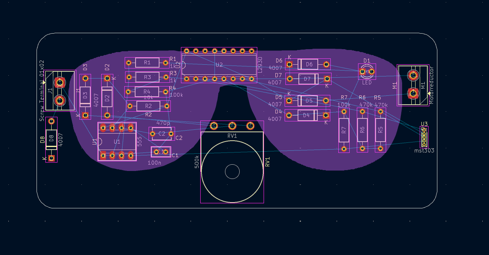
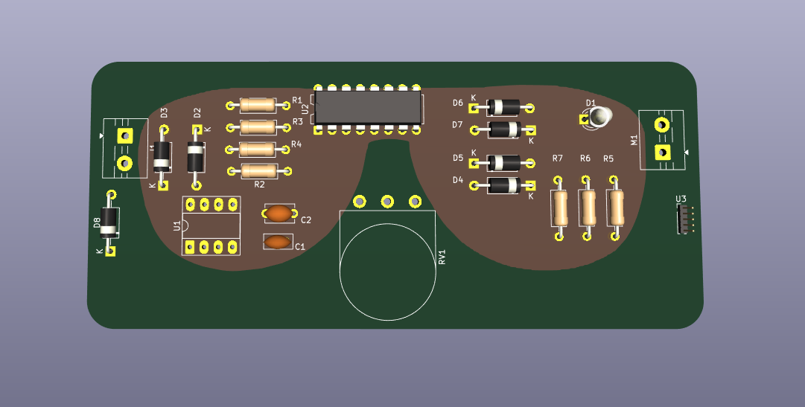
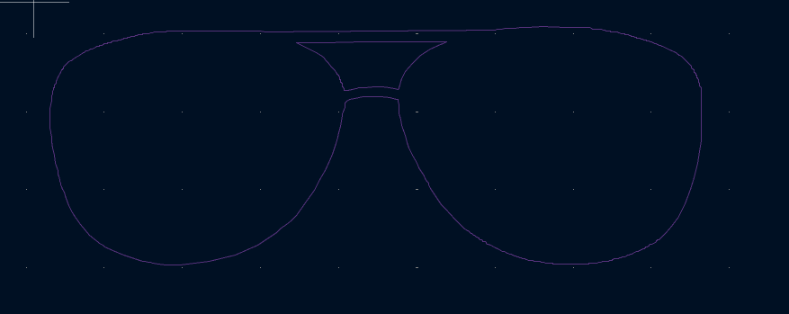

# sesion-15b

## KiCad

### footprints

las footprints son identificadores visuales impresos en la placa. En las placas de método THT incluyen los agujeros necesarios. 

en selector de footprints de KiCad, se diferencian las diferentes huellas por una serie de valores escritos.

- ejemplo 1: R_Axial_DIN0516_L15.5mm_D5.0mm_P20.32mm_Horizontal

tipoDeComponente_tipoDeEncapsulado_standardDelPackage_ longitudCuerpo_diametroCuerpo_pitch*_orientación

- ejemplo 2: C_Disc_D3.4mm_W2.1mm_P2.50mm

tipoDeComponente_tipoDeEncapsulado_diametroCuerpo_espesorCuerpo_pitch*

*el pitch es la separación entre sus pines

## avance kicad

Agregué el screw erminal, donde eventualmente irá la pila. 

### pcb

En un comienzo nuestra pcb era formato carta de presentación(55x85mm), sin embargo, adaptamos el formato para que se adecuara proporcionalmente a la forma del vector utilizado.

Los terminal block a ambos lados del lente representan la "patita" del lente.

El circuito está separado en 2 partes posicionadas en cada uno de los vidrios del lente. Al lado izquierdo se encuentra el circuiuto PWM, con el 555. Al lado derecho se encuentra la parte del motor. Siendo ambas partes conectadas por el L293D.

Esta es la primera versión oficial de nuestra propuesta de diagramación y organización de la pcb.

Render de la propuesta.

La idea es usar una silueta idéntica a la forma del lente físico que estamos ocupando.
