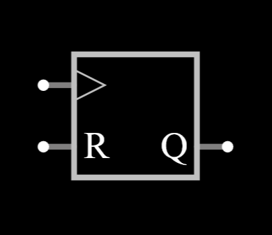
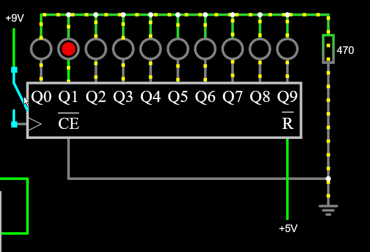
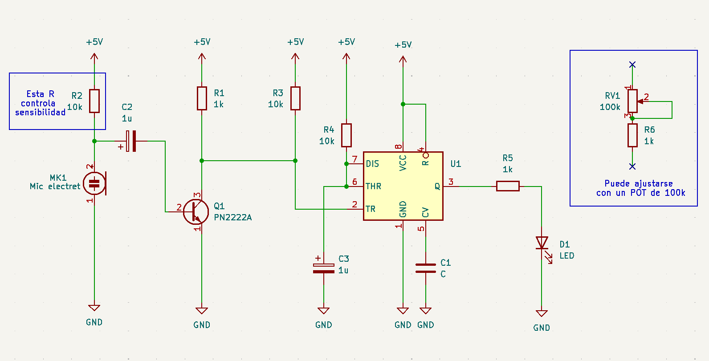

# sesion-14a

[10 de junio del 2025]

## Teloneo

Nuevo path: [00-info](/00-info/) con cómo pedir una revisión, cómo subir las imágenes y como funciona el lint

Aarón nos habló del markdown lint que agregó al repo para poder estandárizar los readme

Cómo nos vamos a organizar en los días que quedan pre-examen

## Prototipado proyecto-02: input

Comenzamos por establecer lo que queríamos que sucediera: luces LED que se encendieran en sequencia cuando detectan sombra y voz

- Sensor de sonido (micrófono?) + LDR en el circuito

- Luces LED estilo ruleta (en sequencia rápida)

- Electret mic para el sensor de sonido

Inicialmente, nos basamos en un circuito de ruleta que estaba en [555 Timer Circuits](https://www.555-timer-circuits.com/roulette.html), pero no lográbamos entender la finalidad del transistor BC557 en el circuito

Misaa nos recomendó buscar un circuito de dado digital y comparar, pero el que encontramos también tenía este componente, por lo que asumimos que era esencial para el circuito que queríamos armar

FranUDP nos recomendó basarnos en el circuito del detector de sombra que vimos en una clase anterior, y agregar un circuito astable

Confundí el chip LM324 (op-amp) con un LM317 (regulador ajustable), así que nuestro primer intento de circuito falló y no entendíamos por qué (chip incorrecto)

Excluyendo el timer 555, no éramos familiares con ninguno de los nombres que habían para los chips, así que tuvimos que asumir cuáles eran los que buscábamos y cómo se usaban

Para la sequencia, comenzamos un chip bajo el nombre "sequence generator", pero claramente no era lo que buscábamos porque solo tenía una salida

Luego nos quedamos con uno llamado "counter", el cual solo era de 4 pasos pero creímos que podíamos hacerlo funcionar. En este punto aún estábamos trabajando con el LM317, así que el circuito estaba destinado a fallar

De todas maneras, resultó ser que este "counter" es un chip que cuenta en sistema binario ([74HC393](https://assets.nexperia.com/documents/data-sheet/74HC_HCT393.pdf)). Lo notamos cuando Aarón sugirió conectar el circuito del chip a un push switch y ver si la secuencia funcionaba

Antes del descubrimiento, noté que este diagrama no tenía un clock enable, así que busqué el pinout del 4017 para ver qué tan esencial era. En esto, vi que alguien llamaba al chip "ring counter" e inmediatamente reconocí el nombre de la lista de chips en falstad

Procedimos a trabajar con el 4017, conectándolo al 555 monostable y a un push switch para comprobar que la sequencia funcionara (si funcionó yipee)

Mientras trabajábamos en el circuito, a Misaa le mencionamos el input de voz y nos entregó un electret mic junto a un circuito para que lo probemos

Aquí la idea de "input de voz" cambió de algo que debería estar integrado en el circuito en sí, a algo aparte, solo por apariencias (detectar voz &rarr; ruleta se enciende vs detectar voz &rarr; *parece* que algo sucede)

