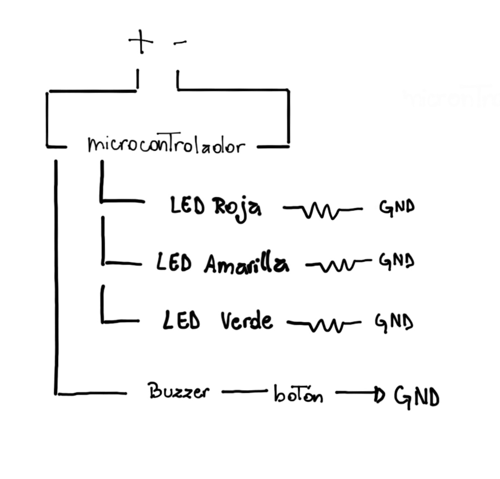

# sesion-13a

03-06-2025

## Encargo 24
* Describir de forma textual 3 proyectos de máquinas electrónicas que quieran hacer de forma individual, ordenar por preferencia o interés de que sea desarrollado.

***Proyecto 01***

* _Descripción_: Máquina electrónica diseñada para acompañar a personas que pasan muchas horas sentadas frente a pantallas, recordándoles de hacer pausas activas. Mediante señales sonoras, visuales o vibración.
* _Objetivo_: Diseñar un dispositivo que notifique al usuario cuando hacer una pausa activa, a través de una máquina electrónica.
* _Usuario_: Trabajadores home office o personas que necesiten de un apoyo externo para regular sus tiempos.
* _Interacción con el usuario_: Genera una señal cada 1 hora de inactividad (puede variar el tiempo)

|Color|Función|
|---|---|
|LED Rojo|Realizar trabajo|
|LED Amarillo|Terminará luego la hora de trabajo|
|LED Verde|Comienza Pausa activa|

* _Contexto de uso_: En escritorios personales, co-works, talleres, etc.
* _Metas_: Disminuir el cansancio acumulado, dolores corporales y estrés
* _Componentes_: Buzzer (vibrador/sonido), luces LEDS, resistencias, botón, microcontrolador
* _Decisiones de diseño_: Formato compacto portátil, que se vea como un compañero de escritorio
* _¿De dónde nació esta idea?_: La idea nace porque siempre veo a mi papá pasar horas trabajando en el escritorio, por lo que no se da cuenta que en algún momento debe de realizar una pausa activa.

***Proyecto 02***
* _Descripción_: Máquina electrónica que reproduce sonidos distorsionados cuando un usuario lo toca.
* _Objetivo_: Diseñar un dispositivo de interacción táctil y sonora, que provoque la curiosidad, la exploración intuitiva.
* _Usuario_: Personas que sean curiosas y con ganas de explorar.
* _Interacción con el usuario_: Sin instrucciones de uso, el usuario encuentra una especie de cubo en la mesa. Al tocarlo, se activará los sensores y reproducirá distintos sonidos.
* _Contexto de uso_: Instalación en exposiciones, museos o espacios académicos.
* _Metas_: Generar una interacción que invite a la exploración física y conceptual. Usar el sonido como única interfaz comunicativa.
* _Componentes_: Microcontrolador, resistencias, cables, batería, sensores, speakers 
* _Decisiones de diseño_: Forma cúbica, donde el circuito esté por dentro, como si fuese un cubo rubik.

## Encargo 25
* Dibujar diagrama de comportamiento, flujos de interacción. No específicar chips. Considerar procesos de manera especulativa. ¿Cuánto tiempo se usará? ¿Qué encendidos y apagados tiene? ¿Cómo se interactúa?

1. 

2. 
