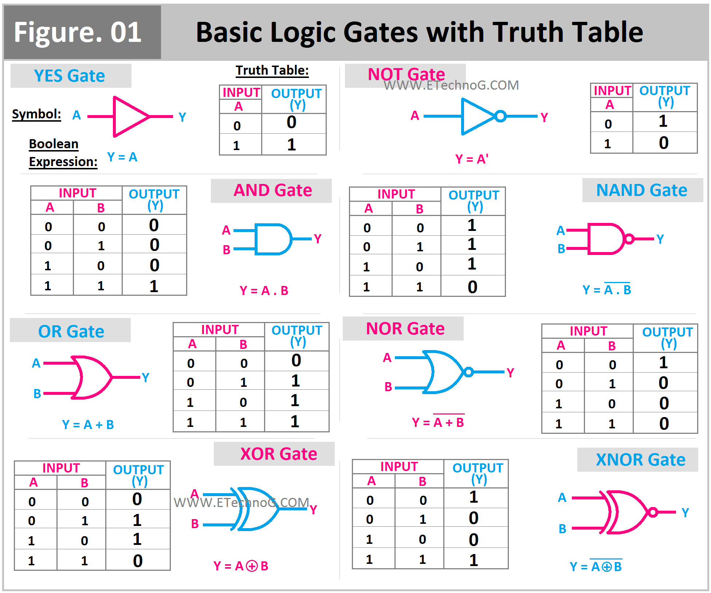

# sesion-13a

## Apuntes

### Propuestas (Encargo [sesión 12b](https://github.com/disenoUDP/dis8644-2025-1-procesos/tree/main/25-FranUDP/sesion-12b))
Después de la clase me acerqué al profe para recibir el *feedback* de las propuestas y me dijo que me enfocara en lo que hace único al objeto, lo que le da su personalidad, alma y escencia.

En el caso del dispenzador de comida para mascotas, ya existen objetos que cumplen esta función, además que por la compleja funcionalidad del aparato, sería más facil hacerlo con un microprocesador. Teniendo esto en cuenta, lo que lo haría especial sería el desafío y complejidad técnica de armar el dispocitivo solo con ICs y 0 microprocesadores

Nunca se me había ocurrido que el desafío de hacer algo desafiante podría tener valor de diseño. Tras ver las ideas de mis compañeros pensaba que me iban a decir (igual que siempre) que no hiciera la idea, porque era muy compleja y puede que no me funcione, a pesar que siempre logro terminarlo (hacer cosas simples no es estimulante, el desafio personal de ayuda a enfocarme).

En cuanto al pomodoro, no es necesario que el objeto sea práctico, por lo que en lugar de ser un pomodoro útil, podría ser uno con ADHD que le cueste "concentrarse" en su tarea de contar el tiempo y se distraiga, distrayendo a su vez al usuario.

Y en cuanto a la idea del guante, el profe me contó sobre un producto similar que, aparte de una persona, nadie usa, debido a que lo hicieron como una herramienta que sirve para todo (muy amplio y ambiguo), en lugar de desarrollarlo para un nicho específico.

### [Logic gates](https://youtu.be/INEtYZqtjTo?si=rw97J9kYS_ao38lh)
Circuitos lógicos, en base a transistores, que emplean álgebra Booleana (1 y 0)

### UCV Rack
Software de sintetizador que permite manipular y generar sonidos. Según lo que entiendo de su página, es un software que emula el comportamiento de múltiples sintetizadores distintos. Es open source, aunque existe una versión de paga.
